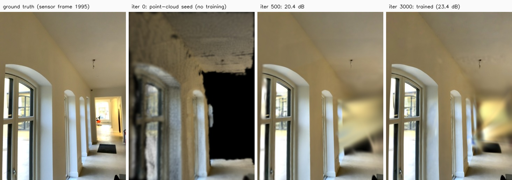

<!--
SPDX-FileCopyrightText: 2026 Povl Filip Sonne-Frederiksen
SPDX-License-Identifier: GPL-3.0-or-later
-->

# Native Gaussian Splatting in ReUseX — research & design

Issue #240. Goal: a **native C++/CUDA** 3D Gaussian Splatting (3DGS) trainer inside
ReUseX that **seeds from our point cloud** and trains on **posed sensor frames +
aligned 360 panoramas**, producing a `.ply` splat and rendered novel views.

## 1. What we can already leverage (no new work)

| Need for 3DGS | Already in ReUseX | Where |
|---|---|---|
| Initial Gaussians (positions+colors) | `point_cloud_xyzrgb` (PointXYZRGB) | `ProjectDB`, produced by `segmentation/reconstruct.cpp` |
| Posed training views (RGB+K+pose) | `sensor_frame_image` / `sensor_frame_intrinsics` / `sensor_frame_pose` | `ProjectDB` |
| Correct camera math (world→cam) | `to_colmap_pose`: `T_wc = T_wb·T_bc`, invert → `T_cw`, quaternion | `libs/reusex/src/io/colmap.cpp` |
| Standard-format dataset dump | `rux export colmap` (frames + PINHOLE cameras + **point-cloud-seeded `points3D.txt`**) | `apps/rux/src/export/colmap.cpp` |
| 360 → perspective cameras | `geometry::overlapping_views` + aligned panorama `pose` (schema v11) | `geometry/EquirectProjection` (#239) |
| CUDA 12.9 build, LibTorch 2.9 (autograd + `torch::optim`) | mature | `cmake/CUDAOptions.cmake`, `pkgs/libtorch` |

The **only** missing capability is the differentiable Gaussian rasterizer + the
optimization loop.

## 2. Library survey & licensing (commercial-safe, per decision)

| Option | License | Verdict |
|---|---|---|
| **gsplat csrc** (nerfstudio) | **Apache-2.0** | ✅ **Chosen rasterizer.** torch-native (`at::Tensor`), CUDA kernels, **built-in `torch::autograd::Function`** wrappers (`RasterizeToPixelsFromWorld3DGSAutograd`, `rasterize_to_pixels_3dgs`). Bundles its own glm. No pybind in `csrc/` → compiles as a clean C++ lib. |
| Inria `graphdeco-inria/gaussian-splatting` | **Non-commercial** | ❌ Avoid (repo policy). |
| LichtFeld-Studio / `gaussian-splatting-cuda` | GPL-3.0 | ⚠️ Same license as us (loop logic is a legal reference), but its bundled rasterizer is **LibTorch-free** (own `lfs::core::Tensor`, namespace `gsplat_lfs`) and the app drags in vcpkg/ffmpeg/imgui/zmq — **not** directly embeddable. Use only as an architecture reference. |
| ds-splat | Apache-2.0 | Python/torch rasterizer; fallback only. |

**Decisive point:** because gsplat's C++ ops already implement torch autograd, a
LibTorch trainer gets gradients *for free* — the native loop is ~a few hundred
lines, not a from-scratch backward pass.

> **Correction (verified against the built library).** The premise above holds,
> but *not* through the entry points this document originally named. See
> §2.1 — the familiar `rasterize_to_pixels_3dgs` path is unusable from C++ in
> our build, and the working path is a different one.

### 2.1 Which C++ entry point actually carries autograd

Checked by `nm` on the built `libgsplat.a` plus a compile-link-run smoke test on
an RTX 6000 Ada. Two claims in the original design were wrong:

| Original claim | Reality |
|---|---|
| `RasterizeToPixelsFromWorld3DGSAutograd` is callable | **No.** It is in an anonymous namespace in `Rasterization.cpp` — a local symbol, declared in no header. |
| `rasterize_to_pixels_3dgs` is autograd-aware | **No.** Its body calls `c10::Dispatcher::findSchemaOrThrow("gsplat::rasterize_to_pixels_3dgs")` and **throws at run time**. |

**Root cause.** All ~90 `TORCH_LIBRARY` schema definitions and every
`TORCH_LIBRARY_IMPL` block live in `gsplat/cuda/ext.cpp`, the pybind entry
point. It sits *outside* `csrc/`, so `pkgs/gsplat-cuda/CMakeLists.txt` — which
globs `csrc/*.{cu,cpp}` — does not compile it. Nothing routed through the torch
dispatcher exists in our archive. Worse, gsplat attaches the backward for those
ops from **Python** (`torch.library.register_autograd` in
`gsplat/cuda/_wrapper.py`), so registering the schemas in C++ would restore only
a forward pass.

**What does work**, and what `libs/reusex/src/gsplat/rasterize.cpp` uses — both
call `torch::autograd::Function` directly, with no dispatcher and no Python:

| Symbol | Header | Gradients flow to |
|---|---|---|
| `rasterize_to_pixels_from_world_3dgs` | `Rasterization.h` | means, quats, scales, colors, opacities |
| `assemble_proj_features` | `SphericalHarmonics.h` | SH coefficients, means, viewmats |

This is gsplat's **3DGUT "eval3d" world-space renderer**, not the EWA
splatting path. Forward-only but dispatcher-free helpers (`projection_ewa_3dgs_fused_fwd`,
`intersect_tile`, `intersect_offset`) supply the tile binning around it.

Three consequences worth recording:

1. **We must register two torch custom classes ourselves.**
   `UnscentedTransformParameters` and `FThetaCameraDistortionParameters` are
   `torch::CustomClassHolder`s stashed as IValues in the autograd context; the
   registration normally lives in the uncompiled `ext.cpp`, and without it the
   *backward* pass dies with "Trying to instantiate a class that isn't a
   registered custom class". One `TORCH_LIBRARY(gsplat, …)` block in
   `rasterize.cpp` replaces it.
2. **Both parameter blocks must be non-null even for a pinhole camera** — gsplat
   dereferences them unconditionally.
3. **No screen-space `absgrad`.** The world path does not produce the
   `means2d_absgrad` tensor that the reference clone/split densification keys
   on, so the first trainer prunes but does not densify (see §3.1). Recovering
   absgrad means hand-writing `torch::autograd::Function`s over the public
   `launch_*_{fwd,bwd}_kernel` symbols — tractable, but a separate increment.

The alternative reading — teach the derivation to compile `ext.cpp` — was
rejected: it drags in pybind11 as a *runtime* dependency and still leaves the
Python-registered backwards missing.

### Better-algorithm remarks (evaluate as follow-ups)
- **2D Gaussian Splatting (2DGS)** — disc Gaussians give far better *surfaces*; gsplat already ships 2DGS kernels (`Projection2DGS*.cu`). **Most relevant to ReUseX** since we produce building *geometry/meshes*, not just novel views.
- **3DGS-MCMC** — principled densification (gsplat ships `MCMCPerturb*`).
- **Faster-GS** (CVPR'26, Apache-2.0) — faster/better optimization schedule.
- **Native-360** (SPaGS, Splatter-360) — spherical rasterization trains directly on equirects, avoiding the slice step; heavier to integrate. Our slice-into-cameras approach reuses #239 and needs no new kernels.

## 3. Native design — `reusex_gsplat` module (WITH_CUDA-gated)

### Phase 0 — vendor gsplat as a C++/CUDA lib (Nix)
`pkgs/gsplat-cuda/package.nix`: compile `gsplat/cuda/csrc/*.{cu,cpp}` (36 `.cu` + 14
`.cpp`) into a static lib, include `csrc/` + bundled `third_party/glm`, link
LibTorch + CUDA, `CMAKE_CUDA_ARCHITECTURES=80;86;89`. gsplat ships **no CMake**
(builds via torch cpp_extension) → we write a small `CMakeLists.txt` in the
derivation. Export headers (`Rasterization.h`, `RasterizeToPixelsFromWorld3DGS.h`,
`Projection.h`, `SphericalHarmonics.h`, `QuatScaleToCovar.h`, `Relocation.h`).
`git add` immediately (Nix sees only tracked files). Wire `overlays/additions.nix`
+ `find_package` in `Dependencies.cmake`. **This is the main build risk** — prove
`nix build .#gsplat-cuda` first.

### Phase 1 — data provider (reuse existing)
`libs/reusex/src/gsplat/TrainingViews.*` → `struct View { torch::Tensor image_chw;
Eigen::Matrix3d K; Eigen::Matrix4d viewmat /*T_cw*/; }`:
- sensor frames: reuse `to_colmap_pose` math (factor it into `io/colmap.hpp`).
- 360 slices: `overlapping_views(equirect, n_yaw, fov, tile)`; slice world pose =
  `T_w_pano · [R_pano_from_view|0]` → `T_cw`; `K` from the slice.
- initial Gaussians from `point_cloud_xyzrgb`: means=XYZ, SH DC from RGB, scales
  from k-NN spacing, opacity const, quats identity.

### Phase 2 — model + trainer (LibTorch)
`GaussianModel` (CUDA tensors: means, log-scales, quats, logit-opacity, SH) +
`GaussianTrainer`: call gsplat `rasterize_to_pixels_from_world_3dgs` (autograd,
see §2.1) → L1 + D-SSIM loss → per-group `torch::optim::Adam` → density control
→ save reference-format `.ply`.

### 3.1 Density control — what shipped, and why it is only half
The reference 3DGS grows Gaussians by cloning/splitting those whose *screen-space*
position gradient exceeds a threshold. That signal (`means2d_absgrad`) is not
available on the world-space rasterizer (§2.1), so the first native trainer does
**pruning only**: it drops Gaussians whose opacity has collapsed or whose extent
has blown up.

This is a smaller loss than it sounds, and it is the point of seeding from a
LiDAR cloud. Densification exists to recover detail an SfM point cloud never
had — a few thousand sparse points growing into millions. Our seed is already
at scan density (173k points on NewOffice before any cap), so the trainer starts
where the reference spends thousands of iterations getting to. What we give up
is refinement *beyond* scan density: thin structures and high-frequency texture
will stay soft.

Two ways to close it, in preference order:
1. **MCMC densification** (3DGS-MCMC) — gsplat ships `MCMCPerturb*` and
   `Relocation.h` as public `launch_*_kernel` symbols, and its relocate/perturb
   scheme needs no screen-space gradient at all. Best fit for this architecture.
2. Hand-written `torch::autograd::Function`s over the EWA
   `launch_*_{fwd,bwd}_kernel` pairs, which do expose absgrad.

### Phase 3 — CLI + render + figures
`rux create gsplat` (mirrors `create/annotate.cpp`): `--iterations --use-panoramas
--n-yaw --fov --sh-degree --out model.ply --render-dir`. Render held-out + orbit
novel views for the PR. Report held-out **PSNR**.

## 4. Effort & risk (honest)

- **Phase 0 (gsplat Nix build)**: fiddly, the gating risk. ~0.5–1 day.
- **Phases 1–3**: bounded thanks to built-in autograd, but densification tuning to
  reach good quality is iterative. ~2–4 days total.
- Realistic first PR: a **working native vertical slice** (seed → train → render on
  NewOffice) with figures, quality below tuned nerfstudio; 2DGS-for-surfaces and
  MCMC densification as follow-ups.

## 5. Pipeline validation (Apache-2.0 gsplat, done)

Before building the native trainer, the **data pipeline** was validated end-to-end
with the Apache-2.0 gsplat rasterizer (a throwaway Python harness, not the shipped
trainer) on NewOffice:

1. `rux align 360` → `rux export colmap --with-panoramas` produced **3936 posed
   images (3876 iPad frames + 60 aligned-panorama slices from 6 panoramas × 10
   tangent views) + 173,225 point-cloud seed points** in `points3D.txt` — one
   self-contained 3DGS input.
2. gsplat ingested it, **initialized Gaussians from our point-cloud seed**,
   densified, and reconstructed the office. Held-out novel view (GT | render):

   

**Takeaways that de-risk the native build:**
- The export (frames + 360 slices + seed) is a correct, trainable 3DGS input —
  camera math (incl. the panorama-slice pose composition) and the seed align.
- 3DGS needs **dense multi-view overlap**: a building-wide sparse sample renders
  black; a contiguous capture segment reconstructs cleanly. The native trainer/CLI
  should train per-region (or the user selects a region), not the whole building at once.
- The throwaway harness under-tunes densification (over-grows, stays soft); the
  native trainer will use gsplat's `DefaultStrategy`/`MCMCStrategy` with tuned
  thresholds for quality.

## 5.1 Native trainer — first working result

The native `reusex_gsplat` module trains end-to-end. Smoke run on the
`office_corridor.rux` test fixture (10 sensor frames, 720×960, ~1.2 m of camera
travel; seeded with `rux create clouds -g 0.015 --sampling-factor 1` →
**109,917 points**), rendered at 480 px long edge on an RTX 6000 Ada:

```
rux -p corridor.rux create gsplat --iterations 3000 --max-image-size 480 \
    --render-dir figs --render-at 0,100,500,1500,3000 -o corridor.ply
```



| iteration | loss (L1 + D-SSIM) | L1 | PSNR | Gaussians |
|---:|---:|---:|---:|---:|
| 100 | 0.1496 | 0.1232 | 10.55 dB | 109,917 |
| 200 | 0.1459 | 0.1191 | 11.46 dB | 109,917 |
| 500 | 0.0584 | 0.0439 | 20.36 dB | 109,917 |
| 1000 | 0.0508 | 0.0349 | 21.58 dB | 109,868 |
| 1500 | 0.0470 | 0.0312 | 22.20 dB | 109,041 |
| 2000 | 0.0485 | 0.0329 | 22.69 dB | 107,683 |
| 2500 | 0.0420 | 0.0296 | 23.03 dB | 106,464 |
| 3000 | 0.0368 | 0.0259 | 23.39 dB | 105,291 |

**3000 iterations in 17.1 s (176 it/s).** PSNR is the running mean over each
100-iteration window on the drawn training view, so it is a *training* number,
not a held-out one — held-out evaluation is the next increment.

Reading the figure: the seed panel is the point cloud rendered as Gaussians with
no optimization at all — already recognisably the corridor, which is the payoff
of seeding from LiDAR rather than from SfM. The black wedge is genuinely
unobserved (the depth import caps at 4 m), and by iteration 3000 the optimizer
has grown neighbouring Gaussians across it. Windows and the arched openings
sharpen substantially between 500 and 3000.

**Known limitations of this first version**, all recorded rather than papered over:
- **Training-view PSNR only.** No held-out split yet.
- **Prune, no densify** (§3.1) — detail beyond seed density will not appear.
- **Not bit-reproducible.** The seed fixes the view order, but gsplat's backward
  accumulates gradients with `atomicAdd`, so the summation order belongs to the
  GPU scheduler. Measured run-to-run spread is ~2.5e-6 relative on the loss
  after 20 iterations; the unit test asserts reproducibility at 1e-3 and says
  why. This is a documented departure from STANDARDS §6.
- **SH degree 0 by default.** View-dependent colour is available
  (`--sh-degree`) but untested at length.

## 6. Verification (native, once built)

`rux create gsplat -p scene.rux --iterations 7000 --use-panoramas --region <frames>
--out model.ply --render-dir figs/`. Confirm `.ply` opens in a standard splat
viewer; report held-out PSNR; include rendered novel-view images (incl. a
with/without-360 coverage comparison) in the PR.
