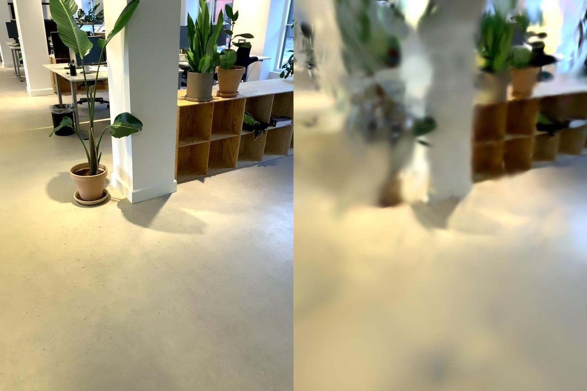

<!--
SPDX-FileCopyrightText: 2026 Povl Filip Sonne-Frederiksen
SPDX-License-Identifier: GPL-3.0-or-later
-->

# Native Gaussian Splatting in ReUseX — research & design

Issue #240. Goal: a **native C++/CUDA** 3D Gaussian Splatting (3DGS) trainer inside
ReUseX that **seeds from our point cloud** and trains on **posed sensor frames +
aligned 360 panoramas**, producing a `.ply` splat and rendered novel views.

## 1. What we can already leverage (no new work)

| Need for 3DGS | Already in ReUseX | Where |
|---|---|---|
| Initial Gaussians (positions+colors) | `point_cloud_xyzrgb` (PointXYZRGB) | `ProjectDB`, produced by `segmentation/reconstruct.cpp` |
| Posed training views (RGB+K+pose) | `sensor_frame_image` / `sensor_frame_intrinsics` / `sensor_frame_pose` | `ProjectDB` |
| Correct camera math (world→cam) | `to_colmap_pose`: `T_wc = T_wb·T_bc`, invert → `T_cw`, quaternion | `libs/reusex/src/io/colmap.cpp` |
| Standard-format dataset dump | `rux export colmap` (frames + PINHOLE cameras + **point-cloud-seeded `points3D.txt`**) | `apps/rux/src/export/colmap.cpp` |
| 360 → perspective cameras | `geometry::overlapping_views` + aligned panorama `pose` (schema v11) | `geometry/EquirectProjection` (#239) |
| CUDA 12.9 build, LibTorch 2.9 (autograd + `torch::optim`) | mature | `cmake/CUDAOptions.cmake`, `pkgs/libtorch` |

The **only** missing capability is the differentiable Gaussian rasterizer + the
optimization loop.

## 2. Library survey & licensing (commercial-safe, per decision)

| Option | License | Verdict |
|---|---|---|
| **gsplat csrc** (nerfstudio) | **Apache-2.0** | ✅ **Chosen rasterizer.** torch-native (`at::Tensor`), CUDA kernels, **built-in `torch::autograd::Function`** wrappers (`RasterizeToPixelsFromWorld3DGSAutograd`, `rasterize_to_pixels_3dgs`). Bundles its own glm. No pybind in `csrc/` → compiles as a clean C++ lib. |
| Inria `graphdeco-inria/gaussian-splatting` | **Non-commercial** | ❌ Avoid (repo policy). |
| LichtFeld-Studio / `gaussian-splatting-cuda` | GPL-3.0 | ⚠️ Same license as us (loop logic is a legal reference), but its bundled rasterizer is **LibTorch-free** (own `lfs::core::Tensor`, namespace `gsplat_lfs`) and the app drags in vcpkg/ffmpeg/imgui/zmq — **not** directly embeddable. Use only as an architecture reference. |
| ds-splat | Apache-2.0 | Python/torch rasterizer; fallback only. |

**Decisive point:** because gsplat's C++ ops already implement torch autograd, a
LibTorch trainer gets gradients *for free* — the native loop is ~a few hundred
lines, not a from-scratch backward pass.

### Better-algorithm remarks (evaluate as follow-ups)
- **2D Gaussian Splatting (2DGS)** — disc Gaussians give far better *surfaces*; gsplat already ships 2DGS kernels (`Projection2DGS*.cu`). **Most relevant to ReUseX** since we produce building *geometry/meshes*, not just novel views.
- **3DGS-MCMC** — principled densification (gsplat ships `MCMCPerturb*`).
- **Faster-GS** (CVPR'26, Apache-2.0) — faster/better optimization schedule.
- **Native-360** (SPaGS, Splatter-360) — spherical rasterization trains directly on equirects, avoiding the slice step; heavier to integrate. Our slice-into-cameras approach reuses #239 and needs no new kernels.

## 3. Native design — `reusex_gsplat` module (WITH_CUDA-gated)

### Phase 0 — vendor gsplat as a C++/CUDA lib (Nix)
`pkgs/gsplat-cuda/package.nix`: compile `gsplat/cuda/csrc/*.{cu,cpp}` (36 `.cu` + 14
`.cpp`) into a static lib, include `csrc/` + bundled `third_party/glm`, link
LibTorch + CUDA, `CMAKE_CUDA_ARCHITECTURES=80;86;89`. gsplat ships **no CMake**
(builds via torch cpp_extension) → we write a small `CMakeLists.txt` in the
derivation. Export headers (`Rasterization.h`, `RasterizeToPixelsFromWorld3DGS.h`,
`Projection.h`, `SphericalHarmonics.h`, `QuatScaleToCovar.h`, `Relocation.h`).
`git add` immediately (Nix sees only tracked files). Wire `overlays/additions.nix`
+ `find_package` in `Dependencies.cmake`. **This is the main build risk** — prove
`nix build .#gsplat-cuda` first.

### Phase 1 — data provider (reuse existing)
`libs/reusex/src/gsplat/TrainingViews.*` → `struct View { torch::Tensor image_chw;
Eigen::Matrix3d K; Eigen::Matrix4d viewmat /*T_cw*/; }`:
- sensor frames: reuse `to_colmap_pose` math (factor it into `io/colmap.hpp`).
- 360 slices: `overlapping_views(equirect, n_yaw, fov, tile)`; slice world pose =
  `T_w_pano · [R_pano_from_view|0]` → `T_cw`; `K` from the slice.
- initial Gaussians from `point_cloud_xyzrgb`: means=XYZ, SH DC from RGB, scales
  from k-NN spacing, opacity const, quats identity.

### Phase 2 — model + trainer (LibTorch)
`GaussianModel` (CUDA tensors: means, log-scales, quats, logit-opacity, SH) +
`GaussianTrainer`: call gsplat `rasterize_to_pixels_3dgs` (autograd) → L1 + D-SSIM
loss → per-group `torch::optim::Adam` → adaptive densify/clone/split/prune +
opacity reset. Save INRIA-compatible `.ply` (`gaussian_ply.*`, mirrors `io/ply.hpp`).

### Phase 3 — CLI + render + figures
`rux create gsplat` (mirrors `create/annotate.cpp`): `--iterations --use-panoramas
--n-yaw --fov --sh-degree --out model.ply --render-dir`. Render held-out + orbit
novel views for the PR. Report held-out **PSNR**.

## 4. Effort & risk (honest)

- **Phase 0 (gsplat Nix build)**: fiddly, the gating risk. ~0.5–1 day.
- **Phases 1–3**: bounded thanks to built-in autograd, but densification tuning to
  reach good quality is iterative. ~2–4 days total.
- Realistic first PR: a **working native vertical slice** (seed → train → render on
  NewOffice) with figures, quality below tuned nerfstudio; 2DGS-for-surfaces and
  MCMC densification as follow-ups.

## 5. Pipeline validation (Apache-2.0 gsplat, done)

Before building the native trainer, the **data pipeline** was validated end-to-end
with the Apache-2.0 gsplat rasterizer (a throwaway Python harness, not the shipped
trainer) on NewOffice:

1. `rux align 360` → `rux export colmap --with-panoramas` produced **3936 posed
   images (3876 iPad frames + 60 aligned-panorama slices from 6 panoramas × 10
   tangent views) + 173,225 point-cloud seed points** in `points3D.txt` — one
   self-contained 3DGS input.
2. gsplat ingested it, **initialized Gaussians from our point-cloud seed**,
   densified, and reconstructed the office. Held-out novel view (GT | render):

   

**Takeaways that de-risk the native build:**
- The export (frames + 360 slices + seed) is a correct, trainable 3DGS input —
  camera math (incl. the panorama-slice pose composition) and the seed align.
- 3DGS needs **dense multi-view overlap**: a building-wide sparse sample renders
  black; a contiguous capture segment reconstructs cleanly. The native trainer/CLI
  should train per-region (or the user selects a region), not the whole building at once.
- The throwaway harness under-tunes densification (over-grows, stays soft); the
  native trainer will use gsplat's `DefaultStrategy`/`MCMCStrategy` with tuned
  thresholds for quality.

## 6. Verification (native, once built)

`rux create gsplat -p scene.rux --iterations 7000 --use-panoramas --region <frames>
--out model.ply --render-dir figs/`. Confirm `.ply` opens in a standard splat
viewer; report held-out PSNR; include rendered novel-view images (incl. a
with/without-360 coverage comparison) in the PR.
