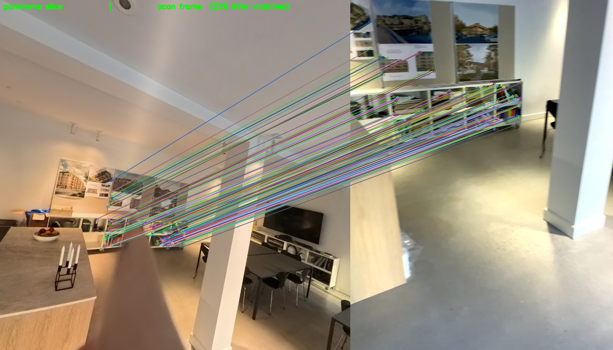
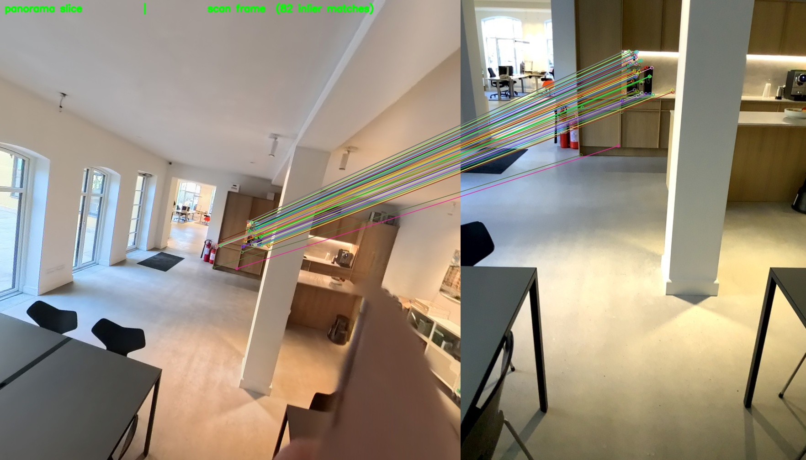
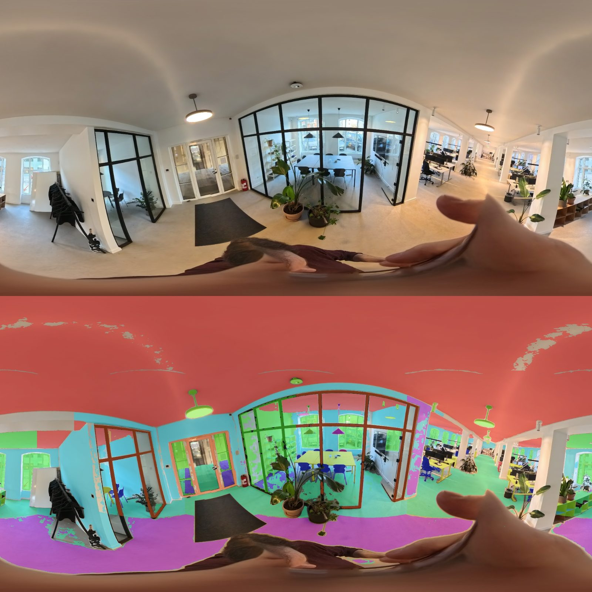
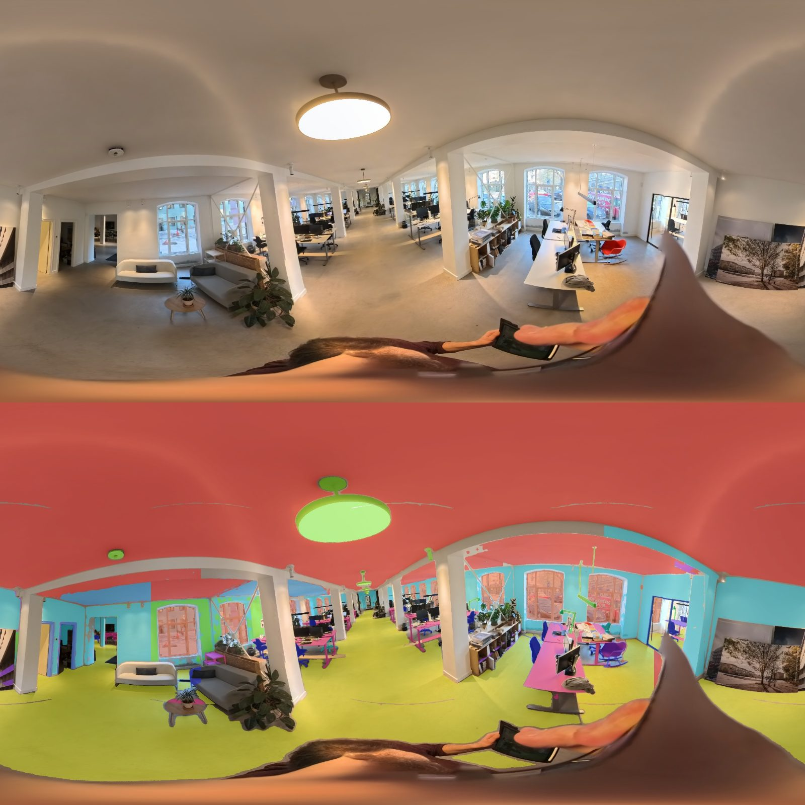

<!--
SPDX-FileCopyrightText: 2026 Povl Filip Sonne-Frederiksen
SPDX-License-Identifier: GPL-3.0-or-later
-->

# Tying 360° panoramas into the pipeline

**Content-based alignment + equirectangular SAM3 segmentation.**

## Problem

360° panoramas were imported (`rux import 360`) and placed on the trajectory by
**nearest EXIF timestamp only** — each panorama inherited the matched sensor
frame's pose verbatim. That gave no independent orientation, no use of image
content, and no way to segment the panorama. This work adds:

1. **Content-based alignment** (`rux align 360`) — refine each panorama's 6-DoF
   pose from image content instead of the timestamp.
2. **Equirectangular SAM3** (`rux create annotate-360`) — segment panoramas with
   the existing SAM3 model via perspective tiling.

Both stand on one new primitive: **equirectangular ⇄ perspective reprojection**
(`geometry/EquirectProjection`).

## Method

### Shared foundation — `geometry/EquirectProjection`
Gnomonic (tangent-plane) rendering of virtual pinhole views from an equirect,
the inverse bearing↔pixel map, sphere tilings (cube faces / overlapping
equator+pole views), and a centrality-weighted label stitch back to equirect.
Panorama frame convention matches the sensor-camera optical frame (x right,
y down, z forward) so a resected panorama pose composes directly with
`sensor_frame_pose`.

### Alignment — `slam/PanoramaAlignment`
For each panorama (seeded to a sensor frame by timestamp):
1. render `n_yaw` overlapping perspective slices of the equirect;
2. ORB-match each slice against nearby sensor frames — the **same** OpenCV ORB +
   Lowe-ratio front-end as `slam/LoopClosure` (BSD, no weights, commercial-safe);
3. lift frame matches to metric 3D via the frame's stored depth + pose;
4. resect the panorama pose per slice with `cv::solvePnPRansac` (each slice is a
   true pinhole with known `K` and known slice→panorama rotation), then refine
   over all slices' inliers with a small Gauss–Newton in panorama-bearing space.

A panorama that fails to reach the inlier threshold keeps its timestamp
placement. The refined pose is written to `panoramic_images` (schema v11) and the
viewer / exporters prefer it when present.

### Segmentation — `vision/segment_panorama`
The SAM3 TensorRT model is **unchanged**: a perspective slice *is* an ordinary
pinhole image at its native 1008². We tile the equirect into overlapping views,
run the existing model per tile (identical prompt list → stable class ids), and
stitch the per-tile label maps back into one equirect label map, stored in the
new `panorama_segmentation` table.

## Results (NewOffice scan: 3876 frames, 18 panoramas, schema v5→v11)

### Alignment
`rux align 360` on the 18 panoramas: **6 aligned** with well-conditioned poses;
the remaining 12 kept their timestamp placement (too few cross-camera matches,
or rejected by the plausibility gate as ill-conditioned). The 360 camera is a
different device from the iPad-LiDAR scan, so cross-camera ORB matching is the
hard part — but where enough features co-observe, the resection is tight:

| panorama | inliers | RMS (deg) |
|----------|--------:|----------:|
| IMG_…_00_010 | 397 | 0.281 |
| IMG_…_00_011 | 270 | 0.421 |
| IMG_…_00_018 | 101 | 0.495 |
| IMG_…_00_019 |  77 | 0.619 |
| IMG_…_00_003 |  60 | 0.609 |
| IMG_…_00_013 |  51 | 0.505 |

Sub-degree angular reprojection RMS on every accepted panorama. Corrections vs.
the timestamp placement were sub-metre to ~2 m (within a room), gated at 5 m.

**The literal alignment signal** — ORB correspondences between a panorama
perspective slice (left) and the matched scan frame (right); these drive the PnP
resection:




> Note on figures: a naive "render the panorama toward the frame and overlay"
> comparison is *misleading* here — the alignment corrects translation by up to a
> few metres, so direction-only reprojection shows parallax, not error. The
> correspondence figure is the honest visual of what the alignment actually uses.

### Segmentation
`rux create annotate-360` tiles each equirect into 8 overlapping perspective
views, runs the unmodified SAM3 TensorRT model per tile, and stitches the
per-tile label maps back to equirect:




Coherent whole-sphere semantics (ceiling / floor / walls / windows / furniture),
with no pole gaps or tile seams — the perspective tiling side-steps the equirect's
polar stretch and the extreme 2:1 aspect ratio SAM3 was never trained on. 18/18
panoramas segmented and stored in `panorama_segmentation`.

## Running it

```bash
rux import rtabmap scan.db --project office.rux   # sensor frames (depth + timestamps)
rux import 360 ./360/                              # panoramas, seeded by timestamp
rux align 360 --figures figs/                      # content-based pose refinement
rux create annotate-360 --net /path/to/sam3-engines/ --figures figs/
```

`rux create annotate-360` requires a TensorRT-enabled build
(`cmake -B build -DWITH_CUDA=ON -DML_BACKENDS=AUTO`); alignment does not.

## Schema

Schema **v11** (auto-migrates): `panoramic_images` gains
`pose / pose_source / align_inliers / align_rms`; new `panorama_segmentation`
table stores an equirect label PNG per panorama (CV_16U +1-offset, the same
convention as `segmentation_images`).

## Out of scope (follow-up — issue #236)
360-driven pose-graph loop closure. The alignment already produces
panorama↔multi-frame correspondences; emitting inter-frame `LoopEdge`s into
`PlaneGraphOptimizer` is a separate PR.
