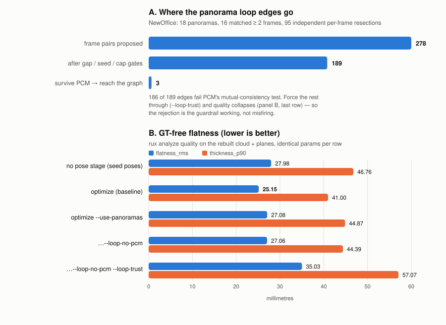

<!--
SPDX-FileCopyrightText: 2026 Povl Filip Sonne-Frederiksen
SPDX-License-Identifier: GPL-3.0-or-later
-->

# 360-driven pose-graph loop closure

**Issue #236.** Turning one panorama's correspondences with many temporally
distant sensor frames into wide-baseline `LoopEdge`s for `PlaneGraphOptimizer`.

## Problem

The plane-landmark back-end makes frames that co-observe the same wall mutually
consistent, but two temporally distant views of the same place that share no
plane-landmark chain are left unconstrained — the "basin problem" of
[`registration-improvements.md`](registration-improvements.md). The ORB
front-end in `slam/LoopClosure` attacks that by matching frame **pairs**, which
requires two narrow-FOV frames to overlap each other; under drift the pair may
never be proposed, and under indoor perceptual aliasing it may be proposed
wrongly.

A 360° panorama sees every direction at once. A single panorama therefore
matches frames that do not overlap each other **at all**, including frames from
opposite ends of the capture. Each panorama is a hub tying a whole group of
temporally distant frames together — structurally, exactly the constraint the
plane back-end cannot supply.

## Method

### The load-bearing decision: where the resection happens

`slam/PanoramaAlignment` (`rux align 360`) resects **one pooled panorama pose in
world coordinates**, from frame keypoints already transformed to world by their
seed poses. It is tempting to reuse that pose and write

```
T_AB = T_pano_A⁻¹ · T_pano_B
```

but that is **circular**. Every ingredient of `T_world_pano` came through
`sensor_frame_pose`, so the composition reproduces `seed(A)⁻¹ · seed(B)` and
carries **zero** drift-correction information: it would restate the drift rather
than measure it.

`slam/PanoramaLoopEdges` therefore resects the panorama **independently against
each matched frame, in that frame's own optical coordinates**:

1. slice the equirect into overlapping perspective views
   (`geometry/EquirectProjection::overlapping_views`);
2. ORB-match each slice against a stride-subsampled sweep of the whole
   trajectory, and lift each matched frame keypoint to metric 3D **in the
   frame's own camera frame** (`p_cam`, no pose applied);
3. for each frame `A` separately, seed `T_pano_A` from the best single
   (slice, frame) `solvePnPRansac` and refine it in panorama-bearing space with
   the shared Gauss-Newton step (`pano_detail::refine_bearing_pose`);
4. for every pair `(A, B)` of independently resected frames of one panorama,
   emit `T_AB = T_pano_A⁻¹ · T_pano_B` as a `geometry::LoopEdge`.

Neither factor reads `sensor_frame_pose`, so `T_AB` is a genuine metric
measurement. The panorama is only a shared rigid intermediate frame — it never
has to be correctly *placed*. Two consequences worth stating:

- **`rux align 360` is not a prerequisite.** Panorama poses are neither read nor
  written by this stage.
- The unit tests pin exactly this: the emitted edge is unchanged when the
  panorama is moved 40 m away, and is recovered correctly when the seed poses
  are deliberately wrong.

### The second decision: candidate frames

`PanoramaAlignmentOptions::candidate_window` is a **temporal** window (±25
frames around the timestamp seed). Every pair it can produce is closer than
`min_frame_gap`, so reusing it would yield *no loop edges at all*. Loop-edge
detection instead sweeps the **whole trajectory**, evenly subsampled to
`--pano-max-frames` (default 240). That global sweep is what lets one panorama
tie temporally-distant revisits together; it is also the dominant cost
(slices × frames descriptor matches), hence the budget.

Frame features are extracted **once** and reused across all panoramas, since the
sweep is global rather than per-panorama.

### Guardrails — all reused, none invented

The emitted edges are the same `LoopEdge` type the ORB front-end emits and go
through the same machinery:

| Guardrail | Where it comes from |
|---|---|
| `min_frame_gap` | `LoopClosureOptions` (`--loop-min-frame-gap`) |
| min / max seed disagreement | `LoopClosureOptions` (`--loop-{min,max}-seed-disagreement`) |
| PCM false-positive rejection | `filter_consistent_loop_edges`, over the **union** of all sources |
| Cross-source dedup | one `BetweenFactor` per frame pair; the ORB edge wins |
| GNC down-weighting | the same `GncOptimizer` graph in `PlaneGraphOptimizer` |
| Inlier-scaled sigmas | same `sqrt(min/​n)` law, looser base (an edge chains **two** resections) |

Plus two panorama-specific gates: a per-panorama edge cap (one panorama
matching *F* frames yields O(*F*²) edges that share the same resection errors
and are therefore not independent measurements), and a plausibility gate
rejecting a resection that places the panorama implausibly far from the frame
(a narrow match cone leaves bearing resection ill-conditioned in translation).

## Determinism

Panoramas and frames are processed in sorted id order, the OpenCV RNG is
re-seeded per panorama, edge selection and capping break ties on `(i, j)`, and
the output is sorted by `(i, j)`. `edges_from_resections` is order-independent:
reversing the input resections produces byte-identical edges.

## Running it

```bash
rux -p scan.rux optimize --use-panoramas                   # panorama edges alone
rux -p scan.rux optimize --loop-closure --use-panoramas    # plus the ORB pair front-end
```

Tuning: `--pano-max-frames`, `--pano-min-inliers`, `--pano-max-edges`,
`--pano-slices`, `--pano-max-features`, `--pano-max-distance`. Gating is shared
with the ORB path (`--loop-min-frame-gap`, `--loop-min-seed-disagreement`,
`--loop-no-pcm`, `--loop-trust`).

## Measured on NewOffice

**Scan.** `~/repos/NewOffice/project.rux` — 3876 frames, 18 panoramas, ~18.6 m
end-to-start drift over an 816 m path, **no ground truth**. It is the only scan
on hand with both panoramas and drift (ARKitScenes has GT but no 360 imagery),
so the primary metric is GT-free `rux analyze quality`
(`flatness_rms` / `thickness_p90`). **This is a real limitation:** flatness
rewards locally-consistent surfaces and cannot by itself distinguish "drift
removed" from "surfaces smeared differently". Every run started from a private
copy of the pristine project; `create clouds` and `create planes` were re-run at
stock defaults for every row so the metric sees each configuration's own poses.



### The front-end does produce edges

| Stage | Count |
|---|---|
| Panoramas | 18 |
| …matching ≥ 2 frames | 16 |
| Independent per-frame resections accepted | 95 |
| Frame pairs proposed | 278 |
| Dropped: `min_frame_gap` / seed-gate / per-panorama cap | 24 / 4 / 56 |
| Duplicate pairs merged across panoramas | 5 |
| **Edges emitted** | **189** |
| **Survive PCM → reach the graph** | **3** |

Detection cost ~18.5 min for 18 panoramas against a 225-frame sweep of the 3876
(every 17th), on top of a 96 s baseline `optimize`.

### Effect on the scan

| Configuration | flatness_rms | thickness_p90 | max pose shift | edges in graph |
|---|---|---|---|---|
| no pose stage (seed poses) | 27.98 mm | 46.76 mm | — | 0 |
| `optimize` (baseline) | **25.15 mm** | **41.00 mm** | 0.2585 m | 0 |
| `optimize --use-panoramas` | 27.08 mm | 44.87 mm | 0.2400 m | 3 |
| … `--loop-no-pcm` | 27.06 mm | 44.39 mm | 0.2955 m | 189 |
| … `--loop-no-pcm --loop-trust` | 35.03 mm | 57.07 mm | 1.1240 m | 189 |

**The acceptance criterion is not met.** The default configuration is *negative*:
25.15 → 27.08 mm rms against the `optimize` baseline.

### What the numbers actually say

**1. The edges are low quality — this is the binding problem.** Under
`--loop-trust` the graph finally acts on them (pose shift 0.26 → 1.12 m) and
quality **collapses to 35.03 mm — worse than running no pose stage at all**.
Edges that make things worse when believed are wrong edges. PCM rejecting
186 of 189 was therefore the guardrail *working*, not misfiring.

The root cause is visible in the front-end's own logs: most candidate frames
resect at **9–19 pooled bearing inliers**, below the threshold, and the
resections that *are* accepted sit at only ~20–47. A bearing resection from ~20
inliers over a narrow match cone is weakly conditioned in translation — and an
edge chains **two** of them. This is the same cross-camera appearance gap (360
camera vs. iPad RGB, different optics and exposure) that let `rux align 360`
align only 6 of 18 panoramas. ORB is simply not a strong enough matcher across
these two cameras.

**2. Suppressed edges are inert, not merely weak.** With PCM on, 3 edges reach
the graph; with PCM off, 189 do — and flatness differs by **0.02 mm**
(27.08 vs 27.06). A 63× increase in wide-baseline constraints changed nothing.
Under the default robust kernel these constraints are down-weighted into
irrelevance.

**3. The small negative effect is GNC interference, not a wrong correction.**
The 3 surviving edges carry huge residuals against the drifted seed
(factor-graph error 1750 → 1846 initial, and the *final* error rises 1066 →
1386, i.e. the plane part of the solution got worse too). High-residual factors
perturb the GNC weight schedule for every other factor, so the plane solution
degrades slightly while the loop edges deliver no correction. That is the
mechanism behind the ~1.9 mm regression.

### What this says about the #225 odometry-trust hypothesis

Issue #225 found that `rux optimize` regresses drifting scans against absolute
GT in every configuration, hypothesising that the odometry factors
(`odometry_sigma_rot 0.005` / `trans 0.01` across 3876 frames) trust the drifted
seed so tightly that no added factor can remove the drift.

This experiment **does not confirm that hypothesis, and should not be read as
confirming it** — edge quality is a confound. The clean test the hypothesis
needs is *accurate* wide-baseline edges that still fail to move the trajectory;
what we have here are inaccurate edges that are correctly suppressed. Two
observations point in opposite directions:

- *Consistent with #225:* under default settings 189 wide-baseline constraints
  moved the poses by 0.2955 m versus 0.2585 m for none at all, on a scan that
  drifts 18.6 m. The trajectory is extremely hard to move.
- *Against a strong reading of #225:* the graph is **not** structurally
  immovable. `--loop-trust` produced a 1.12 m shift, so authority-vs-odometry is
  a tunable balance, not a wall. The default suppression here is the robust
  kernel correctly disbelieving bad data.

The honest conclusion is that **#236 cannot adjudicate #225 until the front-end
produces trustworthy edges.**

### Follow-up

The mechanism, the plumbing and the guardrails are in place and tested; the
measurement quality is the gap. The unblocking step is a stronger matcher, which
already has a home in this codebase:

1. Replace ORB in the panorama front-end with a learned matcher
   (XFeat / LightGlue+ALIKED / EfficientLoFTR), or produce panorama edges
   out-of-process and feed them through the existing license-clean
   `--loop-edges` JSON bridge (`load_loop_edges`) — see
   [`loop-closure-learned-matchers.md`](loop-closure-learned-matchers.md).
   Cross-camera robustness is exactly what learned matchers buy.
2. Re-run this same A/B. If good edges *still* fail to move the trajectory, that
   is the clean confirmation #225 is looking for.
3. Only then revisit PCM's thresholds and the odometry sigmas — tuning either
   now would be fitting to noise.

Reproduce with:

```bash
rux -p scan.rux optimize --use-panoramas        # then create clouds/planes
rux -p scan.rux analyze quality
```
