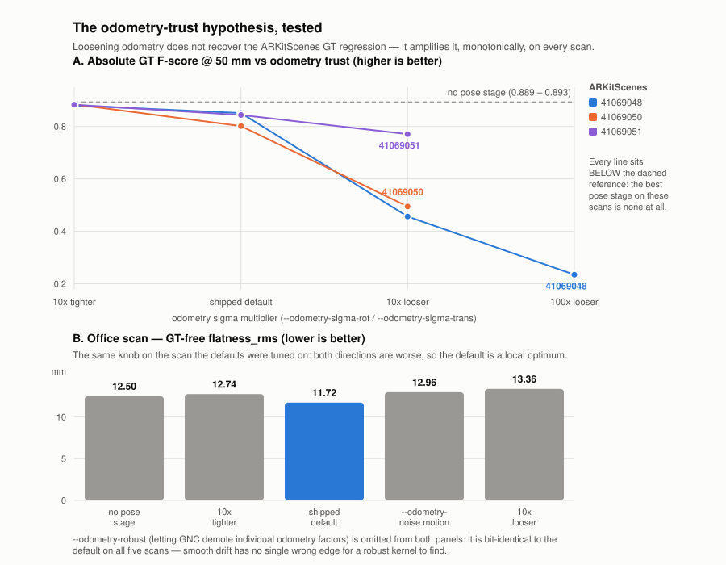

<!--
SPDX-FileCopyrightText: 2026 Povl Filip Sonne-Frederiksen
SPDX-License-Identifier: GPL-3.0-or-later
-->

# Improving Pose Registration in ReUseX: ML Loop Closure & Wide-Baseline Alignment

Decision-ready research report for issue
[#221](https://github.com/pfmephisto/ReUseX/issues/221).
Scope: **offline** refinement of per-frame poses from iPad LiDAR captures of
building interiors (238-1600 frames/scan, ARKit/RTABMap seed poses). Not
real-time.

Grounded in the measured failures from the #221 sweep campaign:

- **Basin problem.** Naive spatial pairing of distant frames failed: loop-closure
  pairs start *outside* the ICP correspondence basin and inject noise. Residual
  gating did not help — it removed exactly the informative (drifted) constraints.
- **Metric saturation.** Frame-to-frame point-to-plane JPR converges to ~11 mm
  internal RMS in *every* config, while downstream plane `flatness_rms` varies
  18-23 mm. Pairwise point-to-plane energy does **not** determine global
  consistency; the remaining ~8 mm of headroom (vs ~10 mm sensor floor) will not
  come from tuning this objective.
- **Best current result:** `rux register --prior-weight 0.1 --neighbor-window 10
  --iterations 50` → flatness 17.7 mm, thickness_p90 27.4 mm (-18% vs no
  refinement).

Every recommendation below names the measured problem it addresses.

---

## 1. Executive summary (5 bullets)

- **The two measured failures are different problems needing different tools.**
  The *basin problem* is a **front-end** failure (we can't find good wide-baseline
  correspondences), and *metric saturation* is a **back-end/objective** failure
  (frame-to-frame point-to-plane can't express global consistency). Fixing one
  without the other will not move the GT/flatness numbers.

- **The highest-leverage, lowest-risk win is the back-end already planned in
  #221: a GTSAM pose-graph with plane-landmark factors + GNC.** GTSAM 4.2.1 is
  *already packaged* (MIT), ships `OrientedPlane3Factor` and built-in Graduated
  Non-Convexity (`GncOptimizer`). This directly attacks metric saturation (it
  optimizes global plane consistency, which is what `analyze quality` measures)
  **and** makes bad loop closures survivable by construction (GNC down-weights
  outlier edges), neutralizing the basin problem's blast radius.

- **For loop-closure *detection*, do not over-engineer.** For single-building
  indoor scans of 238-1600 frames, an all-pairs / retrieval-shortlisted image
  descriptor is cheap and sufficient. Use a **commercial-safe** global descriptor
  (SALAD or CosPlace/EigenPlaces, both permissive) or the MASt3R-SfM-style
  "foundation model as retriever" trick. Point-cloud place recognition
  (ScanContext, LoGG3D, BEVPlace2) is **LiDAR-scan-scale tech and a poor fit** for
  small indoor RGB-D frames — skip it.

- **For wide-baseline *relative pose* (the actual basin fix), the decisive
  question is licensing, not accuracy.** MASt3R/DUSt3R/MASt3R-SfM give the best
  metric-scale relative poses from raw pairs but are **CC-BY-NC (non-commercial)
  — GPL/commercial-unsafe**. The commercial-safe path is **EfficientLoFTR
  (Apache-2.0) or LightGlue (Apache-2.0) → matches → PnP/Kabsch with our existing
  depth → metric relative pose**. Note: **our bundled `superpoint.pt` is under a
  non-commercial license** and should be treated as tainted; prefer DISK/ALIKED or
  the Apache LightGlue+detector stack. **VGGT** now has a **commercial checkpoint
  (July 2025, application-gated)** and is the one foundation-model option worth a
  commercial pilot.

- **Recommended phasing tied to #221:** (P1) build the GTSAM plane-factor +
  GNC back-end reusing JPR's surfel/plane extraction — this is the plateau-breaker
  the sweep pointed to and needs no ML; (P2) add commercial-safe image retrieval
  to *propose* loop candidates and EfficientLoFTR+depth+PnP to *turn them into
  metric edges*, fed into the same GNC graph so bad edges are harmless; (P3)
  optional VGGT/MASt3R evaluation as an accuracy ceiling probe on the MuSHRoom GT.

---

## 2. Findings per research question

### Q1 — Loop-closure detection (which frame pairs to constrain)

**Scale reality check.** Our scans are 238-1600 frames of one building interior.
Brute-force all-pairs descriptor comparison is O(N²) but N is small and
descriptors are ~cheap; even N=1600 is 1.3M dot-products of 512-4096-d vectors —
milliseconds. So *place recognition here is a shortlist/retrieval convenience, not
a scaling necessity.* This means we should optimize for **precision on indoor RGB**
and **commercial-safe licensing**, not for LiDAR-scale throughput.

**Image global descriptors (recommended family).**
- **SALAD** (CVPR 2024, "Optimal Transport Aggregation for VPR",
  [code](https://github.com/serizba/salad)) — current SOTA-tier, DINOv2 backbone,
  permissive code. Strong generalization.
- **CosPlace / EigenPlaces** — classification-trained global descriptors;
  EigenPlaces reports R@1 92.5% Pitts30k, 92.4% Tokyo24/7. Permissive.
- **MixVPR** (WACV 2023, [paper](https://arxiv.org/abs/2303.02190)) — R@1 94.6%
  Pitts250k; feature-mixing MLP, easy to export.
- **AnyLoc** — foundation-model (DINOv2) descriptors; **explicitly reported as
  SOTA on indoor benchmarks** (Baidu Mall, 17 Places, Gardens Point),
  outperforming NetVLAD/CosPlace/MixVPR indoors. Best zero-shot indoor option.
- **Indoor caveat (measured in the literature):** VPR models trained on outdoor
  street data suffer a **domain gap** on indoor RGB-D (improper cluster centers),
  which is exactly why the DINOv2-based zero-shot methods (AnyLoc, SALAD) tend to
  win indoors. See NYC-Indoor-VPR
  ([arXiv 2404.00504](https://arxiv.org/pdf/2404.00504)) and the VPR-for-3D-vision
  evaluation ([arXiv 2603.13917](https://arxiv.org/pdf/2603.13917)).
- **Runtime:** a single global descriptor forward pass is a few ms/frame on GPU;
  building the shortlist for a 1600-frame scan is seconds total.
- **ONNX-exportability:** all of these are ResNet/DINOv2 CNN+MLP graphs (no exotic
  ops) → ONNX/TensorRT export is routine, fitting ReUseX's existing
  ONNX/TensorRT backends.

**"Foundation model as free retriever" (MASt3R-SfM trick).** MASt3R-SfM uses its
own encoder features for retrieval "without any overhead," cutting the pairing
from quadratic to linear. Elegant if we adopt MASt3R anyway, but **NC-licensed**
(see Q2). Not recommended as the retrieval mechanism for a commercial product.

**Point-cloud place recognition (NOT recommended for us).**
- **ScanContext** (handcrafted polar BEV descriptor) — rotation-invariant, cheap,
  no training. But it is designed for **360° LiDAR sweeps**; a single iPad depth
  frame is a narrow frustum, not a panoramic scan, so the polar descriptor is
  ill-posed per frame. Could apply to *accumulated* per-room submaps, not frames.
- **LoGG3D-Net** (ICRA, sparse-conv global descriptor) and **BEVPlace2**
  (T-RO 2025, [code](https://github.com/zjuluolun/BEVPlace2)) — both strong, both
  **built and trained for outdoor LiDAR (KITTI-scale)**. Domain mismatch with
  indoor iPad depth is severe; retraining cost is not justified when image
  retrieval already solves detection cheaply.
- **Verdict:** point-cloud PR buys us nothing our RGB frames don't already give us
  more cheaply. Skip.

**Q1 recommendation:** cheap image-descriptor retrieval to build a **loop-candidate
shortlist** (top-k per frame beyond the temporal window). Start with **AnyLoc or
SALAD** for best indoor precision; both commercial-safe, both ONNX-exportable.
This *proposes* pairs; it does **not** by itself fix the basin problem — that is
Q2's job.

### Q2 — Wide-baseline relative pose (the actual basin fix)

This is the direct antidote to the **basin problem**: instead of hoping ICP finds
correspondences across a large baseline, compute a metric relative pose from a
learned matcher/regressor and inject it as a pose-graph edge, so ICP/JPR is never
asked to cross the basin.

**Two-view matcher + depth → PnP/Kabsch (recommended, commercial-safe).**
- **EfficientLoFTR** (CVPR 2024, [code](https://github.com/zju3dv/EfficientLoFTR),
  **Apache-2.0**, now in HF Transformers) — detector-free semi-dense matches,
  ~2.5× faster than LoFTR. Outputs **2D matches only**; we lift to metric relative
  pose using **our stored per-frame depth** (back-project matched pixels in both
  frames → 3D-3D Kabsch/Umeyama, or 2D-3D PnP + RANSAC). Because we have RGB-D,
  scale is metric and unambiguous — no scale-from-SfM headache.
- **LightGlue + detector** (Apache-2.0 code & weights,
  [LightGlue-ONNX](https://github.com/fabio-sim/LightGlue-ONNX), TensorRT/OpenVINO
  export proven) — sparse, extremely fast, ONNX/TensorRT-ready. **License trap:**
  the classic **SuperPoint detector is non-commercial** — and *our bundled
  `superpoint.pt` inherits that restriction*. For a commercial-safe stack pair
  LightGlue with **DISK or ALIKED** (permissive) detectors, which LightGlue
  officially supports.
- Both are RGB-only matchers; **metric scale comes from our depth**, which is the
  key advantage of being an RGB-D pipeline. This is the pragmatic, license-clean
  basin fix.

**Pointmap-regression foundation models (best accuracy, licensing-gated).**
- **DUSt3R / MASt3R** (NAVER, [MASt3R](https://github.com/naver/mast3r)) — regress
  metric pointmaps from an image pair → **direct metric relative pose**, RGB-only,
  robust to very wide baselines and low overlap (exactly our failure mode).
  **License: CC-BY-NC-SA 4.0 (non-commercial), and the metric checkpoint carries
  extra dataset restrictions (mapfree).** GPL/commercial-unsafe. Runtime ~198
  ms/pair on A40 (original), ~91 ms/pair with **Speedy MASt3R**
  ([arXiv 2503.10017](https://arxiv.org/abs/2503.10017)).
- **MASt3R-SfM** (3DV 2025 Best Student Paper,
  [arXiv 2409.19152](https://arxiv.org/pdf/2409.19152)) — full pipeline:
  retrieval → per-edge local reconstruction → global 3D alignment → global BA,
  exports **COLMAP-style poses**. Architecturally this is *exactly* the pipeline
  #221 wants (retrieval + wide-baseline edges + global optimization). Same **NC
  license** ceiling.
- **VGGT** (CVPR 2025 Best Paper, [code](https://github.com/facebookresearch/vggt))
  — feed-forward transformer, one→hundreds of views → extrinsics, intrinsics,
  depth, pointmaps in <1 s. **Critically: a commercial checkpoint
  `VGGT-1B-Commercial` exists (July 2025, application-gated, excludes military).**
  This is the *only* foundation-model option with a plausible commercial path.
  Worth a pilot as an accuracy ceiling and as a candidate wide-baseline edge
  generator; GPU memory is the main cost (recent May-2026 optimizations give
  2-3× more frames per memory budget).

**Learned point-cloud registration (alternative to image matching).**
- **GeoTransformer** (CVPR 2022 / TPAMI 2023,
  [code](https://github.com/qinzheng93/GeoTransformer), **MIT**) — SOTA indoor
  registration on 3DMatch (2.5 cm voxel, exactly indoor RGB-D scale). Correspondence-
  free coarse-to-fine; robust at low overlap. Commercial-safe. No ONNX out of the
  box (custom sparse ops), so it'd run as a libTorch module — heavier integration.
- **PREDATOR** — designed for **low-overlap** pairs; conceptually the right tool
  for distant loop pairs, but GeoTransformer supersedes it on the same benchmark.
- **FCGF features + TEASER++**
  ([TEASER++](https://github.com/MIT-SPARK/TEASER-plusplus), **MIT**) —
  **certifiably robust** estimator, tolerates 99% outlier correspondences, C++
  (Eigen+Boost), ~0.8 s for ~1900 correspondences with 1700 outliers, **stable
  C++ API**. TEASER++ needs *correspondences as input* (from FPFH — classical,
  no-license-issue — or FCGF — check weight license). This is a strong
  license-clean, no-Python fallback that slots directly into a C++ pipeline and is
  robust to the bad correspondences the basin problem produces.

**Q2 recommendation:** commercial-safe primary = **EfficientLoFTR (or
LightGlue+ALIKED) matches + our depth → RANSAC-PnP/Kabsch → metric relative-pose
edge.** Robust classical fallback with no Python and permissive license =
**FPFH/FCGF + TEASER++ (MIT, C++).** Reserve **VGGT-Commercial** and **MASt3R**
(NC, research-only) for an accuracy-ceiling evaluation on GT, not for the shipping
pipeline.

### Q3 — Robust back-end (this is where metric saturation is actually solved)

The sweep proved the objective is the problem: frame-to-frame point-to-plane RMS
is decoupled from global plane consistency. The fix is to **change what is
optimized** — from pairwise NN residuals to **shared global plane landmarks** —
and to make the back-end **outlier-robust** so wide-baseline loop edges (which will
sometimes be wrong) cannot corrupt the solution.

**GTSAM is already in the flake (MIT, 4.2.1) and has exactly the needed pieces:**
- **`OrientedPlane3Factor`** — pose-to-plane landmark factor. A plane is an
  `OrientedPlane3` (normal + distance); each frame that observes a persistent
  plane contributes a factor. This **directly optimizes plane consistency = the
  `analyze quality` metric**, attacking metric saturation at the objective level.
  (A single plane measurement doesn't fully constrain a pose, so combine with
  odometry/prior factors — well documented,
  [reference test](https://github.com/rising-turtle/graph_slam/blob/master/gtsam/test/testOrientedPlane3Factor.cpp).)
- **`GncOptimizer` (Graduated Non-Convexity)** — built-in outlier-robust
  optimization. Loop-closure edges from Q2 that are wrong get automatically
  down-weighted. **This is the principled replacement for the residual-gating that
  failed in the sweep**: GNC keeps informative-but-large residuals early
  (non-convex → convex schedule) instead of hard-cutting them. Also relevant:
  Efficient/Adaptive GNC variants ([arXiv 2310.06765](https://arxiv.org/abs/2310.06765),
  [arXiv 2308.11444](https://arxiv.org/pdf/2308.11444)) if GNC iteration count
  becomes a bottleneck.
- Alternatives to GNC that GTSAM also supports conceptually: **switchable
  constraints** and **dynamic covariance scaling** — but GNC is built-in and is
  the current best-practice default.

**How modern RGB-D pipelines structure this (reference architectures):**
- **Open3D multiway registration** — the canonical template: pose graph with
  **odometry edges** (temporal neighbors, ICP) + **loop-closure edges**
  (non-neighbors, global registration, less reliable), then a two-pass
  `global_optimization` with a **line-process** that prunes false loop edges.
  This is essentially GNC-by-another-name and validates the whole architecture.
- **HLoc** — retrieval (image descriptors) → local feature matching → PnP; the
  standard "retrieval + matcher + geometric verify" recipe we mirror in Q1+Q2.
- **BundleFusion** — global pose optimization over RGB-D with sparse+dense terms;
  historical proof that global (not pairwise) optimization is what yields metric
  consistency.

**Q3 recommendation:** build a GTSAM factor graph = seed-pose priors + temporal
odometry factors (JPR-quality) + **`OrientedPlane3Factor` plane landmarks** +
wide-baseline loop factors (Q2), solved with **`GncOptimizer`**. This is the
plateau-breaker #221 already identified, now with concrete GTSAM primitives.

### Q4 — Pragmatic minimal high-impact pipeline for ReUseX

Given assets already integrated (TensorRT/libTorch/ONNX backends, GTSAM packaged,
PCL/CGAL, existing JPR surfel+plane extraction, stored per-frame depth + poses):

**Minimal pipeline (each stage maps to a measured problem):**

1. **Plane extraction & association** *(metric saturation)* — reuse JPR's surfel
   extraction to detect persistent planes; associate observations across frames
   into shared `OrientedPlane3` landmarks. Effort ~**3-5 d** (association is the
   fiddly part; can bootstrap from existing CGAL plane segmentation).
2. **GTSAM back-end with plane factors + GNC** *(metric saturation + makes bad
   loops safe)* — assemble the graph, solve with GNC, write refined poses back.
   Effort ~**4-6 d** (GTSAM already packaged; wiring + gauge/prior handling +
   write-back mirrors existing `refine_sensor_poses`). **This P1 alone should move
   flatness/thickness and is ML-free.**
3. **Loop-candidate retrieval** *(basin problem, step 1 of 2)* — AnyLoc or SALAD
   global descriptor, top-k shortlist beyond temporal window. Export to
   ONNX/TensorRT. Effort ~**2-3 d** (fits existing backend; mostly plumbing).
   License: commercial-safe.
4. **Wide-baseline metric edges** *(basin problem, step 2 of 2)* —
   EfficientLoFTR/LightGlue matches on shortlisted pairs + stored depth →
   RANSAC-PnP/Kabsch → metric relative-pose factor into the GNC graph. Effort
   ~**4-6 d** (matcher export + depth back-projection + robust PnP + edge
   covariance calibration). License: commercial-safe (with ALIKED/DISK detector,
   NOT the bundled SuperPoint).
5. **Local polish** *(final mm)* — existing JPR as a post-GNC refinement on the
   now-globally-consistent poses. Effort ~**1 d** (already exists).

**Licensing summary (commercial safety):**
- Commercial-safe: GTSAM (MIT), TEASER++ (MIT), GeoTransformer (MIT),
  EfficientLoFTR (Apache-2.0), LightGlue code+weights (Apache-2.0), SALAD/CosPlace/
  EigenPlaces/MixVPR (permissive), VGGT-1B-**Commercial** (application-gated).
- **NOT commercial-safe (research-only):** MASt3R/DUSt3R/MASt3R-SfM
  (CC-BY-NC-SA), classic **SuperPoint** detector+weights (non-commercial) — **this
  taints our bundled `superpoint.pt`; do not ship it in a commercial pose
  pipeline.**
- **GPL note:** ReUseX is GPL-3.0-or-later. MIT/Apache/BSD deps are compatible
  (they can be combined into GPL). NC-licensed models are *usage*-restricted
  regardless of GPL and must be excluded from any commercial deliverable.

**GPU/runtime cost per scan (order-of-magnitude, 1600 frames):**
- Retrieval descriptors: ~few ms/frame → ~seconds/scan.
- Shortlist matching (say top-8 loops/frame beyond window): ~12.8k pairs ×
  ~10-50 ms (EfficientLoFTR/LightGlue) → **minutes**, GPU-bound but offline-fine.
- GTSAM GNC solve: seconds-to-low-minutes for a graph of 1600 poses + a few
  hundred plane landmarks + loop edges (sparse, CPU).
- (If VGGT/MASt3R pilot: ~0.1-0.2 s/pair, GPU-memory-bound — feasible offline.)

---

## 3. Ranked recommendation table

Impact = expected effect on `flatness_rms`/`thickness_p90` and GT accuracy.
Effort = integration days. License = commercial safety.

| Rank | Approach | Measured problem addressed | Expected impact | Effort | Risk | License |
|------|----------|----------------------------|-----------------|--------|------|---------|
| 1 | **GTSAM pose-graph: `OrientedPlane3Factor` plane landmarks + `GncOptimizer`** (reuse JPR plane extraction) | Metric saturation (changes the objective to global plane consistency) + makes bad loops safe | **High** — directly optimizes the metric `analyze quality` measures; #221's identified plateau-breaker | 7-11 d | Low (GTSAM packaged, primitives exist; plane association is the unknown) | MIT ✅ |
| 2 | **Loop-candidate retrieval (AnyLoc / SALAD) → shortlist** | Basin problem (proposes which pairs to constrain) | Medium (enabler for #3; no direct metric gain alone) | 2-3 d | Low | Permissive ✅ |
| 3 | **EfficientLoFTR / LightGlue+ALIKED + depth → RANSAC-PnP/Kabsch → metric loop edges** | Basin problem (crosses the baseline without ICP) | **High** — supplies the wide-baseline constraints ICP/JPR provably cannot | 4-6 d | Medium (edge covariance calibration; GNC absorbs bad edges) | Apache-2.0 ✅ (avoid SuperPoint) |
| 4 | **FPFH/FCGF + TEASER++** (C++, robust fallback for #3) | Basin problem (certifiably-robust wide-baseline reg.) | Medium-High | 3-5 d | Low-Med (C++/MIT, no Python; FCGF weight license TBD) | MIT ✅ |
| 5 | **VGGT-1B-Commercial** (feed-forward multi-view poses/pointmaps) | Basin problem + accuracy ceiling | Medium-High (pilot/ceiling probe) | 5-8 d | Medium (application-gated weights, GPU memory) | Commercial ckpt ⚠️ (gated) |
| 6 | **GeoTransformer** (learned indoor PC registration) | Basin problem (alt. to image matching) | Medium | 5-8 d | Medium (libTorch module, no ONNX, custom ops) | MIT ✅ |
| 7 | **MASt3R / MASt3R-SfM** (metric pointmap → direct pose) | Basin problem (best raw accuracy) | High accuracy — **research/eval only** | 4-6 d | Med + **license blocker** | CC-BY-NC ❌ |
| 8 | Point-cloud place recognition (ScanContext / LoGG3D / BEVPlace2) | Loop detection | **Low for us** (LiDAR-scale, indoor RGB-D domain mismatch) | 5-10 d | High (domain gap, retraining) | Mixed |

---

## 4. Phased implementation proposal (tied to #221)

**Phase P1 — Plane-landmark GTSAM back-end (ML-free plateau-breaker).**
*Addresses metric saturation.* Reuse JPR surfel/plane extraction → associate
persistent planes into `OrientedPlane3` landmarks → GTSAM graph (seed priors +
temporal odometry + plane factors) solved with `GncOptimizer` → write poses back
via the existing `refine_sensor_poses` path. Gate on `rux analyze quality`
(flatness/thickness) and MuSHRoom GT. **This is the single most important step and
requires no ML.** Effort ~7-11 d. Success criterion: beat the current 17.7 mm /
27.4 mm best.

**Phase P2 — Wide-baseline loop edges (the basin fix), fed into P1's GNC graph.**
*Addresses the basin problem.* (a) AnyLoc/SALAD retrieval shortlist (ONNX/TensorRT);
(b) EfficientLoFTR/LightGlue+ALIKED matches on shortlisted pairs + stored depth →
RANSAC-PnP/Kabsch → metric relative-pose factors added to the *same* GNC graph so
wrong edges are down-weighted, not gated. Effort ~6-9 d. Success criterion: GT
accuracy improves on loopy scans without regressing flatness (GNC guards against
the noise injection the sweep observed).

**Phase P3 — Accuracy-ceiling probe (evaluation only, not shipped).**
Run **VGGT-1B-Commercial** (and, offline/non-commercially, **MASt3R-SfM**) on a few
scans against MuSHRoom GT to measure how much headroom remains above P1+P2. If VGGT
edges materially beat the LoFTR+depth edges, promote VGGT-Commercial to a shipping
edge generator (its commercial checkpoint makes this legally viable, unlike MASt3R).
Effort ~5-8 d, informational.

**Guardrails carried from the sweep:** keep determinism (fixed seeds) so
before/after deltas stay real; every phase reports `flatness_rms`/`thickness_p90`
+ GT; never hard-gate loop residuals — let GNC do outlier handling.

---

## 5. Key sources

- MASt3R (CC-BY-NC): https://github.com/naver/mast3r ·
  paper https://arxiv.org/pdf/2406.09756
- MASt3R-SfM (3DV 2025): https://arxiv.org/pdf/2409.19152
- Speedy MASt3R (91 ms/pair): https://arxiv.org/abs/2503.10017
- VGGT (CVPR 2025 Best Paper; commercial ckpt Jul 2025):
  https://github.com/facebookresearch/vggt · https://vgg-t.github.io/
- EfficientLoFTR (Apache-2.0): https://github.com/zju3dv/EfficientLoFTR
- LightGlue-ONNX (Apache-2.0; SuperPoint NC caveat):
  https://github.com/fabio-sim/LightGlue-ONNX
- SALAD (CVPR 2024): https://github.com/serizba/salad
- MixVPR (WACV 2023): https://arxiv.org/abs/2303.02190
- Indoor VPR / domain gap: https://arxiv.org/pdf/2404.00504 ·
  https://arxiv.org/pdf/2603.13917
- GeoTransformer (MIT): https://github.com/qinzheng93/GeoTransformer ·
  https://arxiv.org/abs/2308.03768
- TEASER++ (MIT, certifiable): https://github.com/MIT-SPARK/TEASER-plusplus
- BEVPlace2 (T-RO 2025): https://github.com/zjuluolun/BEVPlace2
- Open3D multiway registration:
  https://www.open3d.org/docs/latest/tutorial/pipelines/multiway_registration.html
- GTSAM OrientedPlane3Factor test:
  https://github.com/rising-turtle/graph_slam/blob/master/gtsam/test/testOrientedPlane3Factor.cpp
- Efficient/Adaptive GNC for PGO: https://arxiv.org/abs/2310.06765 ·
  https://arxiv.org/pdf/2308.11444

---

## 6. Measured results (2026-09-02, current pipeline)

Everything above was written against the #221 sweep numbers. Re-running the
whole matrix on the **current** pipeline (after the #218–#222 reconstruction /
segmentation work) changes the baselines materially, so the numbers below
supersede the "17.7 mm" targets in the executive summary and in issue #225.

All configs measured identically (fresh copy → pose stage → `create clouds` →
`create planes` → `analyze quality` / `analyze accuracy`), deterministic seeds.

### Office scan `afb3234950` (238 frames) — GT-free flatness

| pose stage | flatness_rms | thickness_p90 |
|---|---|---|
| none (baseline) | 12.50 mm | 20.42 mm |
| `register` (JPR: `--prior-weight 0.1 --neighbor-window 10 --iterations 50`) | **8.68 mm** | 14.42 mm |
| `optimize` (old defaults, unweighted) | 12.60 mm | 20.47 mm |
| `optimize` (new defaults, inlier-weighted) | 11.72 mm | 19.12 mm |
| `optimize` (old) → `register` | 9.24 mm | 15.16 mm |
| `optimize` (dense) → `register` | 10.00 mm | 16.17 mm |

### MuSHRoom honka (1596 frames) — laser GT F-score @ 50 mm + flatness

| pose stage | GT F-score | flatness_rms |
|---|---|---|
| none (baseline) | 0.7950 | 27.98 mm |
| `register` (JPR) | 0.7556 | (flatness improves, **GT worsens**) |
| `optimize` (old defaults, unweighted) | 0.7925 | 27.82 mm |
| `optimize` dense, **un**weighted | 0.7591 | 29.44 mm |
| `optimize` dense, inlier-**weighted** | 0.7922 | 27.09 mm |
| `optimize` (new defaults, weighted) | **0.7958** | **24.91 mm** |
| `optimize --loop-closure` (aggressive) | 0.7701 | 29.61 mm |
| `optimize --loop-closure` (conservative) | 0.7889 | 27.36 mm |

### Findings

1. **The 17.7 mm target is obsolete.** The pipeline improvements moved JPR from
   17.7 mm → 8.68 mm on the office scan. JPR (local point-to-plane) now
   dominates *GT-free flatness* — the "pairwise energy provably saturates"
   premise no longer holds at these magnitudes.

2. **JPR trades laser GT accuracy for flatness.** On honka (which has good input
   poses and a Faro reference) JPR *lowers* the GT F-score 0.795 → 0.756 while
   improving flatness. Optimising the pairwise objective warps global geometry.

3. **"Denser plane extraction" (the #225 next-lever) is counterproductive on its
   own** — measured, not assumed: naive dense extraction dropped honka GT
   0.795 → 0.759. Root cause: every `OrientedPlane3Factor` carried equal
   authority, so the many small/weak planes dense extraction adds warped the
   trajectory. The bottleneck was landmark *reliability*, not count.

4. **Fix — per-observation inlier weighting (shipped, B).** Scaling each plane
   factor's sigma by `sqrt(ref/inliers)` (self-calibrating on the median inlier
   count) turns dense extraction from harmful into helpful: honka dense goes
   0.759 → 0.792, and the new mid-density weighted defaults reach 0.7958 GT
   (> baseline 0.7950, > JPR 0.756) **and** 24.91 mm flatness (< baseline
   27.98). `optimize` is now the only pose stage that improves GT-free flatness
   *without* degrading laser GT.

5. **`optimize` → `register` chaining does not beat JPR alone** on office
   (9.24 / 10.00 vs 8.68). On already-globally-consistent scans, prepending the
   global stage only gives JPR a worse local starting point. Not shipped as a
   default; both stages remain independently invocable.

6. **P2 loop edges (shipped infrastructure, C) do not help the current benchmark
   scans** — because those scans have no wide-baseline drift to fix. Detection
   is fast and correct (honka: ~4k candidate edges in ~20 s), but on honka the
   edges are ~neutral-to-slightly-negative on GT (0.795 → ~0.789), and
   over-confident edge sigmas actively hurt (0.770). Loop closure is OFF by
   default with conservative defaults. Its payoff requires (a) a genuinely
   loopy/drifting scan with GT — see #221 Tier 2 (ARKitScenes / TLS importer) —
   and/or (b) the learned-matcher upgrade (EfficientLoFTR / LightGlue+ALIKED)
   the `LoopClosure` matcher interface is built to accept.

### Loop-closure detection follow-up (2026-09-02)

Prompted by the office scan actually having start→end drift that no loop closure
would align. Findings, all measured:

1. **Spatial (pose-based) proposal is structurally blind to drift loops.** It
   shortlists pairs by camera-centre proximity *in the seed poses*, but drift
   pulls the true start/end partners far apart there, so that pair is never
   proposed. Fixed with pose-INDEPENDENT proposal: an appearance bag-of-words
   over the frames' ORB descriptors, plus an `exhaustive` all-pairs mode, plus
   `auto` (exhaustive on small scans, appearance on large). On the office scan
   the BoW shortlist *still* misses the loop under indoor perceptual aliasing,
   so `auto` correctly falls back to exhaustive there.

2. **Detection was the wrong suspect; verification was the bottleneck.**
   Exhaustive proposal tried all 17k office pairs and accepted 0 edges at the
   old thresholds. Loosening ORB verification (3000 features, 0.10 m 3D-3D
   threshold — iPad depth is noisy) surfaced a genuine start/end loop:
   frame-gap ~215, ~90 RANSAC inliers, ~12 m disagreement with the drifted seed.

3. **GNC discards drift-correcting loop edges by construction.** A loop edge
   that corrects large drift has a huge residual at the drifted seed, which
   GNC-TLS classifies as an outlier and zeros — so `--loop-closure` alone (GNC)
   detects but does not apply big corrections. `--loop-trust` + a looser
   `--odometry-sigma-trans` lets it flow: loop edges get their own, far more
   generous GNC-TLS inlier threshold (`--loop-trust-inlier-cost`) instead of the
   shared `--gnc-inlier-cost`, so a genuine large-drift correction stays an
   inlier while an edge above even that threshold is still truncated to zero
   weight. (A `noiseModel::Robust` wrapper cannot be used for this: GTSAM's
   `GncOptimizer` constructor strips robust kernels from every factor it is
   given, which would silently leave a "trusted" edge as an unbounded Gaussian.
   Under `--no-gnc` there is no GNC machinery, so a Huber kernel provides the
   bound instead.)

4. **Two safeguards make detection usable:** PCM (keep the largest mutually
   consistent edge set — rejects aliasing false positives) and a LOWER
   seed-disagreement gate (drop edges that already agree with the seed, so loop
   closure is a no-op on well-aligned scans — recovered honka GT 0.73 → 0.79).

5. **Open limit:** on a GT-less scan with repeated structure, applying the
   detected loop (`--loop-trust`) currently *degrades* the GT-free flatness/
   thickness metrics on the office scan (17.9 / 29.0 mm vs 12.5 / 20.4) with a
   ~16 m correction. Whether that is overshoot/aliasing or a globally-correct
   alignment the *local* metric penalises is unknowable without absolute GT.
   Safe automatic application needs (a) GT to validate (#221 Tier 2) and (b) a
   discriminative learned matcher (EfficientLoFTR / LightGlue+ALIKED) to cut the
   aliasing false-positive rate the ORB front-end suffers on repetitive interiors.

### Recommended next steps (revised)

- **#221 Tier 2 GT importer** is now the critical path: every back-end lever
  (P2 loop edges, aggressive plane weighting) is only measurable on a scan that
  actually drifts *and* has absolute GT. The current fixtures are already
  near the sensor floor, so they cannot show the wins these levers target.
- **Learned matcher** for `LoopClosure` (commercial-safe EfficientLoFTR or
  LightGlue+ALIKED via the TensorRT backend) once (1) is in place.
- Keep `register` for flatness-only work and `optimize` for GT-safe global
  refinement; document the trade-off (done in the CLI help).

---

## 7. Plane-factor measurement noise, measured against absolute GT (2026-09-08, #225)

The first measurement of `rux optimize` against the **ARKitScenes** ground-truth
meshes. Everything before this section validated the stage on the office scan
(no GT) and on MuSHRoom honka (laser GT, but a capture that does not drift).
Adding a third fixture class — captures that *do* drift *and* have absolute GT —
changes two conclusions.

### 7.1 What was changed

`PlaneNoiseModel`, selecting how the per-observation noise of each
`OrientedPlane3Factor` is derived:

| model | sigma of one observation |
|---|---|
| `uniform` | `plane_sigma_*`, unscaled |
| `inlier_count` (shipped default, #228) | `plane_sigma_* × clamp(sqrt(median_N / N))` — one scalar on **both** channels |
| `fit_geometry` (new, opt-in) | normal and distance scaled **separately** from the fit's own statistics |

The `fit_geometry` sigmas are the standard first-order uncertainty of a
least-squares plane through `N` points with point noise `σ` (the fit's
point-to-plane residual RMS) and in-plane RMS extent `r`:

```
sigma_distance = σ / sqrt(N)
sigma_normal   = σ / (r · sqrt(N))
```

Both are then normalised by their **median over the run**, so `plane_sigma_normal`
/ `plane_sigma_distance` keep their meaning as the sigmas of a median-quality
observation and the plane term's aggregate authority against odometry is
unchanged — only its *distribution across observations* differs. This makes the
model a strict generalisation of `inlier_count`, which it reproduces exactly when
`σ` and `r` are uniform.

Two things motivated it. First, `inlier_count` discards the two signals that
actually distinguish a trustworthy plane: how planar the supporting surface is,
and how large it is. Second, extent enters the *normal* channel and not the
offset channel, so no single scalar can express it — a 20 cm patch and a 3 m wall
at equal `N` and `σ` are equally certain about *where* the plane is and an order
of magnitude apart on *how it is oriented*.

### 7.2 Results

Identical protocol for every row: fresh copy of the `.rux` → pose stage →
`create clouds -g 0.05` → `create planes` → `analyze quality` + `analyze
accuracy` against the scene's GT mesh. `fit` rows use
`--plane-weight-min 0.10 --plane-weight-max 15` (see §7.3).


**ARKitScenes (raw ARKit poses — these drift — vs `<video_id>_3dod_mesh.ply`):**

| scan | pose stage | GT F@50mm ↑ | chamfer ↓ | median acc. ↓ | flatness ↓ |
|---|---|---|---|---|---|
| 41069048 | none | **0.8917** | **37.00 mm** | **15.75 mm** | **17.49 mm** |
| 41069048 | optimize `inliers` | 0.8512 | 42.17 mm | 23.20 mm | 19.43 mm |
| 41069048 | optimize `fit` | 0.8576 | 41.88 mm | 21.89 mm | 19.02 mm |
| 41069050 | none | **0.8934** | **34.52 mm** | **17.59 mm** | **17.63 mm** |
| 41069050 | optimize `inliers` | 0.8015 | 43.15 mm | 27.58 mm | 21.17 mm |
| 41069050 | optimize `fit` | 0.8171 | 39.55 mm | 24.07 mm | 21.05 mm |
| 41069051 | none | **0.8893** | **35.47 mm** | **18.64 mm** | 24.84 mm |
| 41069051 | optimize `inliers` | 0.8437 | 39.34 mm | 23.19 mm | 24.63 mm |
| 41069051 | optimize `fit` | 0.8877 | 36.33 mm | 21.38 mm | **23.04 mm** |

**MuSHRoom honka (1596 frames, Faro laser GT — this capture does *not* drift):**

| pose stage | GT F@50mm ↑ | chamfer ↓ | median acc. ↓ | flatness ↓ |
|---|---|---|---|---|
| none | 0.7572 | 71.52 mm | 33.52 mm | 27.98 mm |
| optimize `inliers` | **0.7595** | **69.46 mm** | **32.19 mm** | **24.91 mm** |
| optimize `fit` | 0.7523 | 71.54 mm | 33.97 mm | 26.84 mm |

**Office `afb3234950` (GT-free; flatness / thickness p90):** none 12.50 / 20.42 mm;
`inliers` 11.72 / 19.12 mm; `fit` at the tuned clamp 11.66 / 18.99 mm. The office
scan cannot separate the models — it is already near the sensor floor, and its
stored poses have had JPR applied (pipeline log entry 248), so it is not a
"no refinement" baseline in the strict sense. The numbers above reproduce the
2026-09-02 re-baseline in §6 exactly, which is what validates the harness.

### 7.3 The clamp is model-specific, and that is measurable

`plane_weight_min` / `plane_weight_max` bound the per-observation sigma scale.
The two models have very different dynamic range: `inlier_count` varies only as
`sqrt(N)`, so `[0.5, 3.0]` barely binds, whereas `fit_geometry` divides by extent
*linearly* and varies far more. At the inherited `[0.5, 3.0]`, **62% of office
observations saturated the clamp**, collapsing the model into a near-binary
weighting that scored *worse* than the legacy model:

| clamp | office flatness | office p90 |
|---|---|---|
| `[0.5, 3]` (legacy range) | 13.03 mm | 20.95 mm |
| `[0.25, 4]` | 12.39 mm | 20.17 mm |
| `[0.15, 8]` | 11.98 mm | 19.52 mm |
| **`[0.10, 15]`** | **11.66 mm** | **18.99 mm** |
| `[0.05, 30]` | 12.06 mm | 19.62 mm |
| `[0.02, 50]` | 12.06 mm | 19.62 mm (clamp no longer binds) |

The optimizer now **warns at run time, with the counts**, when the clamp rather
than the fit quality is setting most weights (STANDARDS §5) — that warning is
what diagnosed this in the first run rather than after a blind sweep.

### 7.4 Two conclusions

1. **`fit_geometry` helps exactly where the poses are wrong.** It beats
   `inlier_count` on every metric of all three drifting ARKitScenes scans
   (12/12 comparisons; GT F +0.8% / +1.9% / +5.2%, median accuracy −5.6% /
   −12.7% / −7.8%) and loses on the one capture that does not drift. This is the
   *same* drift-dependence the loop-closure front-end showed in §6 —
   "loop closure is for drifting scans; keep it OFF for well-posed ones". The
   generalised statement is: **machinery that redistributes authority toward
   strong geometric evidence pays when the seed trajectory is wrong and costs
   when it is already right.** It therefore ships **opt-in**
   (`--plane-noise fit`), leaving the default bit-identical to #228 and the honka
   guard at zero regression.

2. **`rux optimize` regresses ARKitScenes against absolute GT, in every
   configuration.** On all three scans the best pose stage is *no pose stage*
   (F 0.89 → 0.80–0.86). `fit_geometry` recovers 16–100% of that gap but does not
   close it. This was invisible until now because the stage had only ever been
   scored on a GT-free scan and on a non-drifting one. It is the first hard
   evidence that the plane-landmark back-end is **not yet a net win on drifting
   captures** — which is precisely the case it was built for.

   The most likely mechanism, and the next thing to test: the odometry factors
   are built from consecutive **seed** poses at tight sigmas (0.005 rad /
   0.01 m). On a drifting capture that tightly trusts a trajectory which is
   *known to be wrong*, so the solve cannot remove drift and the plane factors
   can only add distortion on top. The fix is not more plane weighting — it is
   making odometry trust reflect the seed's actual local reliability, or
   supplying the global constraint the odometry chain lacks (loop edges, #236).

### 7.5 Reproducing

```bash
rux -p scan.rux optimize --plane-noise fit --plane-weight-min 0.10 --plane-weight-max 15
rux -p scan.rux create clouds -g 0.05 && rux -p scan.rux create planes
rux -p scan.rux analyze quality  -o quality.json
rux -p scan.rux analyze accuracy path/to/gt_mesh.ply -o accuracy.json
```

The figure is regenerated from the `*-accuracy.json` reports with
`scripts/plot-plane-noise-figure.py` (`REPORT_DIR=<dir> OUT=<png>`).

## 8. The odometry-trust hypothesis, tested and falsified (2026-09-09, #225)

§7.4 closed with a hypothesis for why `rux optimize` regresses every
ARKitScenes scan against absolute GT:

> the odometry factors are built from consecutive **seed** poses at tight sigmas
> (0.005 rad / 0.01 m). On a drifting capture that tightly trusts a trajectory
> which is *known to be wrong*, so the solve cannot remove drift and the plane
> factors can only add distortion on top.

It is a plausible story and it is **wrong**. This section is the measurement.

### 8.1 What odometry trust actually looks like today

`PlaneGraphOptimizer.cpp` builds one `BetweenFactor<Pose3>` per consecutive
frame pair from the **seed** poses, with a single global sigma pair
(`odometry_sigma_rot` / `odometry_sigma_trans`), multiplied by
`underconstrained_odom_scale` (0.25, i.e. *tighter*) when either endpoint spans
fewer than two independent landmark normals. Two further properties matter:

- the graph's only absolute anchor is a **very tight gauge prior on frame 0**
  (`prior_sigma_* = 0.001`), so the trajectory is pinned at one end and the
  odometry chain propagates from there;
- every odometry factor is registered through `GncParams::setKnownInliers`, so
  **GNC structurally cannot down-weight one**.

The first property has a consequence worth stating before any measurement:
scaling *all* odometry sigmas by `k` is, up to the gauge prior, equivalent to
dividing all plane sigmas by `k`. A uniform odometry-trust sweep is therefore
not really a test of "odometry vs. truth" — it is a **plane-authority sweep**.
That is exactly what makes it a clean test of the hypothesis: if the seed is the
problem, relaxing it must help.

### 8.2 Intervention 1 — sweep the odometry sigmas (no code)

Identical protocol to §7.2 (fresh copy → pose stage → `create clouds -g 0.05` →
`create planes` → `analyze quality`/`accuracy`). The `none` and default rows
reproduce §7.2 **exactly on all five scans**, which is what validates the
harness before reading anything into the new rows.

**ARKitScenes, GT F@50mm (higher is better):**

| odometry trust | 41069048 | 41069050 | 41069051 |
|---|---|---|---|
| *no pose stage* | **0.8917** | **0.8934** | **0.8893** |
| 10x tighter (0.0005 / 0.001) | 0.8802 | 0.8845 | 0.8831 |
| **shipped default (0.005 / 0.01)** | 0.8512 | 0.8015 | 0.8437 |
| 10x looser (0.05 / 0.1) | 0.4565 | 0.4948 | 0.7708 |
| 100x looser (0.5 / 1.0) | 0.2346 | — | — |

The relationship is **monotone on every scan and in the opposite direction to
the hypothesis**. Loosening odometry does not recover the regression, it
amplifies it — catastrophically (41069048 median accuracy error 23.2 mm → 60.1 mm
→ 137.8 mm). Tightening odometry moves the result back *toward* the
no-pose-stage baseline, and the limit of "best odometry trust" on these scans is
the trust level at which the stage does nothing at all.

The observability guard was suspected in §7.4 of being "correct when the seed is
good, backwards when it isn't". Measured, it is not backwards: disabling it
(`--underconstrained-odom-scale 1.0`) makes 41069048 **worse** (F 0.8512 →
0.8443). Tightening odometry on under-constrained frames is helping.

### 8.3 Intervention 2 — redistribute odometry trust per edge (`--odometry-noise motion`)

A uniform scale is a blunt instrument, so the next question is whether the
*distribution* of odometry trust is wrong even if its aggregate is right. New
opt-in model: sigma proportional to each edge's own seed motion, normalised by
the run's median (so aggregate authority against the plane term is unchanged —
the same design as `--plane-noise fit`). Physically this is the textbook
"odometry error grows with distance travelled": a frame pair the device barely
moved between is a near-noiseless relative measurement.

| scan | metric | default | `--odometry-noise motion` |
|---|---|---|---|
| 41069048 | F@50mm | **0.8512** | 0.8492 |
| 41069050 | F@50mm | **0.8015** | 0.7642 |
| 41069051 | F@50mm | 0.8437 | **0.8441** |
| honka | F@50mm | **0.7595** | 0.7540 |
| office | flatness_rms | **11.72 mm** | 12.96 mm |

Neutral-to-worse everywhere. Redistribution does not recover the regression
either.

### 8.4 Intervention 3 — let GNC demote odometry (`--odometry-robust`)

The sharpest form of the hypothesis: perhaps a few grossly-wrong seed edges
carry the drift, and the problem is only that `setKnownInliers` forbids GNC from
demoting them. Dropping odometry from the known-inlier set and giving it its own
6-DoF TLS threshold (chi²(6, 0.99)/2 = 8.41) tests exactly that.

The result is the cleanest of the three: **bit-identical output on all five
scans.** Same F-score, same chamfer, same flatness, same max pose shift, to
every digit reported. GNC classified every odometry factor as an inlier anyway.

That is a real finding rather than a null: **the drift on these captures is not
carried by a few bad edges.** It accumulates smoothly across thousands of
individually-good relative measurements, so there is no outlier for a robust
kernel to find. Robustness is the wrong tool for smooth drift — which is also
why loop closure (a constraint from *outside* the chain) is the structurally
right one, and why #236's inability to produce trustworthy edges is the actual
blocker.

### 8.5 The office scan says the default is already at a local optimum

Office `afb3234950` has no GT, but it is the scan the odometry sigmas were
originally tuned on, and it separates the two directions:

| odometry trust | flatness_rms | thickness_p90 | max pose shift |
|---|---|---|---|
| *no pose stage* | 12.50 mm | 20.42 mm | — |
| 10x tighter | 12.74 mm | 20.62 mm | 0.0008 m |
| **shipped default** | **11.72 mm** | **19.12 mm** | 0.0685 m |
| 10x looser | 13.36 mm | 21.87 mm | 0.4982 m |
| `--odometry-noise motion` | 12.96 mm | 21.30 mm | 0.1112 m |

Both directions are worse. The shipped odometry trust is a **local optimum for
the GT-free metric**, and 10x tighter is not merely worse than the default, it is
worse than doing nothing (12.74 vs 12.50 mm) — the stage becomes a near-no-op
(0.8 mm max shift) that only adds re-segmentation noise.

### 8.6 Verdict

**The odometry-trust hypothesis is falsified**, on all three axes it could be
attacked from: uniform scaling (§8.2, monotonically harmful), per-edge
redistribution (§8.3, neutral-to-worse) and selective robust demotion (§8.4,
inert). The odometry chain is the *accurate* part of this factor graph. What
costs absolute accuracy on drifting captures is the **plane term**, and no
setting of odometry trust repairs it — the setting that scores best on GT is
simply the one closest to disabling the stage.

The sharper statement the numbers support, which supersedes §7.4's guess:

> `rux optimize` is calibrated against a **GT-free surface-consistency** metric,
> and on drifting captures that metric and absolute accuracy actively disagree.
> The plane term buys local flatness (office 12.50 → 11.72 mm, honka 27.98 →
> 24.91 mm) by making co-observed surfaces mutually consistent — and it pays for
> it in global accuracy, because with only 28 landmarks surviving hygiene over
> ~2000 frames it can bend the trajectory without any absolute reference to
> stop it.

This also revises the "loosen odometry so drift can redistribute" advice that
`--loop-trust` documentation still carries: loosening odometry is only safe when
something else supplies an absolute constraint. #310 measured the same wall from
the other side — with 189 wide-baseline edges applied, `--loop-trust` moved the
poses 1.12 m and quality collapsed. Both experiments now point at one
prerequisite: **a trustworthy global constraint**, which today does not exist in
this pipeline.

Consequently the next increment should **not** be another odometry or plane
weighting knob. In priority order:

1. **Landmark yield and association quality.** 4646 detections collapse to 28
   landmarks on 41069048, with 2137 merges blocked by the overlap gate. A plane
   term that touches so few landmarks cannot be a global regularizer; it is a
   sparse, high-leverage distortion. Whether the gates are too aggressive is
   directly measurable now that a GT harness exists.
2. **A GT-gated stopping rule.** The stage currently always writes poses back.
   With absolute GT available on three scans, "does this solve actually improve
   accuracy" is answerable per configuration rather than assumed.
3. **Global constraints (#236)**, once a matcher can produce edges that survive
   PCM — the only mechanism that can remove drift rather than redistribute it.

### 8.7 What shipped

Nothing that changes a default. `--odometry-noise motion`, `--odometry-robust`,
`--odometry-weight-min/max` and `--odometry-gnc-inlier-cost` ship **opt-in**;
the default path is bit-identical (verified by re-running the default
configuration on 41069048 after the change: F 0.8512 / chamfer 42.17 mm /
median accuracy 23.20 mm / flatness 19.43 mm / max shift 0.0657 m, matching the
pre-change run to every digit). They are kept because they are the instruments
that produced this verdict, and re-deriving them for the next experiment would
cost more than carrying them.



### 8.8 Reproducing

```bash
# the sweep that falsifies the hypothesis
rux -p scan.rux optimize --odometry-sigma-rot 0.05 --odometry-sigma-trans 0.1
rux -p scan.rux optimize --odometry-noise motion
rux -p scan.rux optimize --odometry-robust
# then, for every row:
rux -p scan.rux create clouds -g 0.05 && rux -p scan.rux create planes
rux -p scan.rux analyze quality  -o quality.json
rux -p scan.rux analyze accuracy path/to/gt_mesh.ply -o accuracy.json
```
