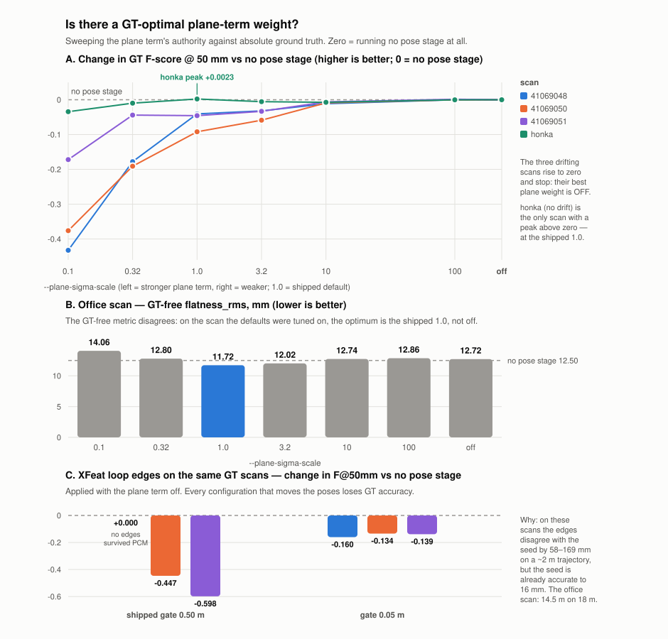
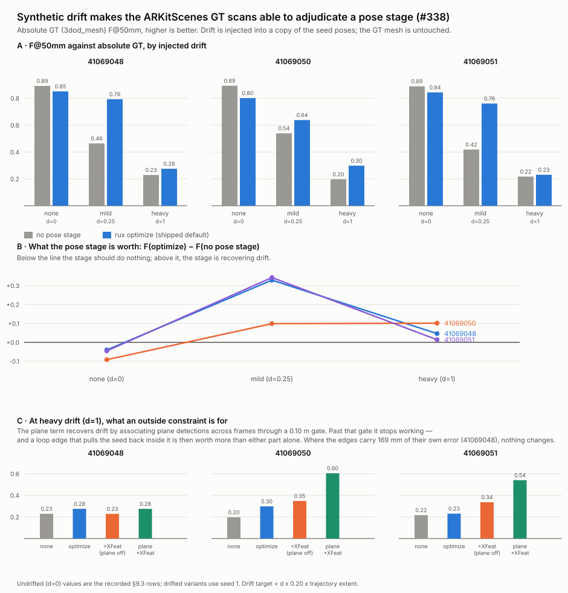

<!--
SPDX-FileCopyrightText: 2026 Povl Filip Sonne-Frederiksen
SPDX-License-Identifier: GPL-3.0-or-later
-->

# Improving Pose Registration in ReUseX: ML Loop Closure & Wide-Baseline Alignment

Decision-ready research report for issue
[#221](https://github.com/pfmephisto/ReUseX/issues/221).
Scope: **offline** refinement of per-frame poses from iPad LiDAR captures of
building interiors (238-1600 frames/scan, ARKit/RTABMap seed poses). Not
real-time.

Grounded in the measured failures from the #221 sweep campaign:

- **Basin problem.** Naive spatial pairing of distant frames failed: loop-closure
  pairs start *outside* the ICP correspondence basin and inject noise. Residual
  gating did not help — it removed exactly the informative (drifted) constraints.
- **Metric saturation.** Frame-to-frame point-to-plane JPR converges to ~11 mm
  internal RMS in *every* config, while downstream plane `flatness_rms` varies
  18-23 mm. Pairwise point-to-plane energy does **not** determine global
  consistency; the remaining ~8 mm of headroom (vs ~10 mm sensor floor) will not
  come from tuning this objective.
- **Best current result:** `rux register --prior-weight 0.1 --neighbor-window 10
  --iterations 50` → flatness 17.7 mm, thickness_p90 27.4 mm (-18% vs no
  refinement).

Every recommendation below names the measured problem it addresses.

---

## 1. Executive summary (5 bullets)

- **The two measured failures are different problems needing different tools.**
  The *basin problem* is a **front-end** failure (we can't find good wide-baseline
  correspondences), and *metric saturation* is a **back-end/objective** failure
  (frame-to-frame point-to-plane can't express global consistency). Fixing one
  without the other will not move the GT/flatness numbers.

- **The highest-leverage, lowest-risk win is the back-end already planned in
  #221: a GTSAM pose-graph with plane-landmark factors + GNC.** GTSAM 4.2.1 is
  *already packaged* (MIT), ships `OrientedPlane3Factor` and built-in Graduated
  Non-Convexity (`GncOptimizer`). This directly attacks metric saturation (it
  optimizes global plane consistency, which is what `analyze quality` measures)
  **and** makes bad loop closures survivable by construction (GNC down-weights
  outlier edges), neutralizing the basin problem's blast radius.

- **For loop-closure *detection*, do not over-engineer.** For single-building
  indoor scans of 238-1600 frames, an all-pairs / retrieval-shortlisted image
  descriptor is cheap and sufficient. Use a **commercial-safe** global descriptor
  (SALAD or CosPlace/EigenPlaces, both permissive) or the MASt3R-SfM-style
  "foundation model as retriever" trick. Point-cloud place recognition
  (ScanContext, LoGG3D, BEVPlace2) is **LiDAR-scan-scale tech and a poor fit** for
  small indoor RGB-D frames — skip it.

- **For wide-baseline *relative pose* (the actual basin fix), the decisive
  question is licensing, not accuracy.** MASt3R/DUSt3R/MASt3R-SfM give the best
  metric-scale relative poses from raw pairs but are **CC-BY-NC (non-commercial)
  — GPL/commercial-unsafe**. The commercial-safe path is **EfficientLoFTR
  (Apache-2.0) or LightGlue (Apache-2.0) → matches → PnP/Kabsch with our existing
  depth → metric relative pose**. Note: **our bundled `superpoint.pt` is under a
  non-commercial license** and should be treated as tainted; prefer DISK/ALIKED or
  the Apache LightGlue+detector stack. **VGGT** now has a **commercial checkpoint
  (July 2025, application-gated)** and is the one foundation-model option worth a
  commercial pilot.

- **Recommended phasing tied to #221:** (P1) build the GTSAM plane-factor +
  GNC back-end reusing JPR's surfel/plane extraction — this is the plateau-breaker
  the sweep pointed to and needs no ML; (P2) add commercial-safe image retrieval
  to *propose* loop candidates and EfficientLoFTR+depth+PnP to *turn them into
  metric edges*, fed into the same GNC graph so bad edges are harmless; (P3)
  optional VGGT/MASt3R evaluation as an accuracy ceiling probe on the MuSHRoom GT.

---

## 2. Findings per research question

### Q1 — Loop-closure detection (which frame pairs to constrain)

**Scale reality check.** Our scans are 238-1600 frames of one building interior.
Brute-force all-pairs descriptor comparison is O(N²) but N is small and
descriptors are ~cheap; even N=1600 is 1.3M dot-products of 512-4096-d vectors —
milliseconds. So *place recognition here is a shortlist/retrieval convenience, not
a scaling necessity.* This means we should optimize for **precision on indoor RGB**
and **commercial-safe licensing**, not for LiDAR-scale throughput.

**Image global descriptors (recommended family).**
- **SALAD** (CVPR 2024, "Optimal Transport Aggregation for VPR",
  [code](https://github.com/serizba/salad)) — current SOTA-tier, DINOv2 backbone,
  permissive code. Strong generalization.
- **CosPlace / EigenPlaces** — classification-trained global descriptors;
  EigenPlaces reports R@1 92.5% Pitts30k, 92.4% Tokyo24/7. Permissive.
- **MixVPR** (WACV 2023, [paper](https://arxiv.org/abs/2303.02190)) — R@1 94.6%
  Pitts250k; feature-mixing MLP, easy to export.
- **AnyLoc** — foundation-model (DINOv2) descriptors; **explicitly reported as
  SOTA on indoor benchmarks** (Baidu Mall, 17 Places, Gardens Point),
  outperforming NetVLAD/CosPlace/MixVPR indoors. Best zero-shot indoor option.
- **Indoor caveat (measured in the literature):** VPR models trained on outdoor
  street data suffer a **domain gap** on indoor RGB-D (improper cluster centers),
  which is exactly why the DINOv2-based zero-shot methods (AnyLoc, SALAD) tend to
  win indoors. See NYC-Indoor-VPR
  ([arXiv 2404.00504](https://arxiv.org/pdf/2404.00504)) and the VPR-for-3D-vision
  evaluation ([arXiv 2603.13917](https://arxiv.org/pdf/2603.13917)).
- **Runtime:** a single global descriptor forward pass is a few ms/frame on GPU;
  building the shortlist for a 1600-frame scan is seconds total.
- **ONNX-exportability:** all of these are ResNet/DINOv2 CNN+MLP graphs (no exotic
  ops) → ONNX/TensorRT export is routine, fitting ReUseX's existing
  ONNX/TensorRT backends.

**"Foundation model as free retriever" (MASt3R-SfM trick).** MASt3R-SfM uses its
own encoder features for retrieval "without any overhead," cutting the pairing
from quadratic to linear. Elegant if we adopt MASt3R anyway, but **NC-licensed**
(see Q2). Not recommended as the retrieval mechanism for a commercial product.

**Point-cloud place recognition (NOT recommended for us).**
- **ScanContext** (handcrafted polar BEV descriptor) — rotation-invariant, cheap,
  no training. But it is designed for **360° LiDAR sweeps**; a single iPad depth
  frame is a narrow frustum, not a panoramic scan, so the polar descriptor is
  ill-posed per frame. Could apply to *accumulated* per-room submaps, not frames.
- **LoGG3D-Net** (ICRA, sparse-conv global descriptor) and **BEVPlace2**
  (T-RO 2025, [code](https://github.com/zjuluolun/BEVPlace2)) — both strong, both
  **built and trained for outdoor LiDAR (KITTI-scale)**. Domain mismatch with
  indoor iPad depth is severe; retraining cost is not justified when image
  retrieval already solves detection cheaply.
- **Verdict:** point-cloud PR buys us nothing our RGB frames don't already give us
  more cheaply. Skip.

**Q1 recommendation:** cheap image-descriptor retrieval to build a **loop-candidate
shortlist** (top-k per frame beyond the temporal window). Start with **AnyLoc or
SALAD** for best indoor precision; both commercial-safe, both ONNX-exportable.
This *proposes* pairs; it does **not** by itself fix the basin problem — that is
Q2's job.

### Q2 — Wide-baseline relative pose (the actual basin fix)

This is the direct antidote to the **basin problem**: instead of hoping ICP finds
correspondences across a large baseline, compute a metric relative pose from a
learned matcher/regressor and inject it as a pose-graph edge, so ICP/JPR is never
asked to cross the basin.

**Two-view matcher + depth → PnP/Kabsch (recommended, commercial-safe).**
- **EfficientLoFTR** (CVPR 2024, [code](https://github.com/zju3dv/EfficientLoFTR),
  **Apache-2.0**, now in HF Transformers) — detector-free semi-dense matches,
  ~2.5× faster than LoFTR. Outputs **2D matches only**; we lift to metric relative
  pose using **our stored per-frame depth** (back-project matched pixels in both
  frames → 3D-3D Kabsch/Umeyama, or 2D-3D PnP + RANSAC). Because we have RGB-D,
  scale is metric and unambiguous — no scale-from-SfM headache.
- **LightGlue + detector** (Apache-2.0 code & weights,
  [LightGlue-ONNX](https://github.com/fabio-sim/LightGlue-ONNX), TensorRT/OpenVINO
  export proven) — sparse, extremely fast, ONNX/TensorRT-ready. **License trap:**
  the classic **SuperPoint detector is non-commercial** — and *our bundled
  `superpoint.pt` inherits that restriction*. For a commercial-safe stack pair
  LightGlue with **DISK or ALIKED** (permissive) detectors, which LightGlue
  officially supports.
- Both are RGB-only matchers; **metric scale comes from our depth**, which is the
  key advantage of being an RGB-D pipeline. This is the pragmatic, license-clean
  basin fix.

**Pointmap-regression foundation models (best accuracy, licensing-gated).**
- **DUSt3R / MASt3R** (NAVER, [MASt3R](https://github.com/naver/mast3r)) — regress
  metric pointmaps from an image pair → **direct metric relative pose**, RGB-only,
  robust to very wide baselines and low overlap (exactly our failure mode).
  **License: CC-BY-NC-SA 4.0 (non-commercial), and the metric checkpoint carries
  extra dataset restrictions (mapfree).** GPL/commercial-unsafe. Runtime ~198
  ms/pair on A40 (original), ~91 ms/pair with **Speedy MASt3R**
  ([arXiv 2503.10017](https://arxiv.org/abs/2503.10017)).
- **MASt3R-SfM** (3DV 2025 Best Student Paper,
  [arXiv 2409.19152](https://arxiv.org/pdf/2409.19152)) — full pipeline:
  retrieval → per-edge local reconstruction → global 3D alignment → global BA,
  exports **COLMAP-style poses**. Architecturally this is *exactly* the pipeline
  #221 wants (retrieval + wide-baseline edges + global optimization). Same **NC
  license** ceiling.
- **VGGT** (CVPR 2025 Best Paper, [code](https://github.com/facebookresearch/vggt))
  — feed-forward transformer, one→hundreds of views → extrinsics, intrinsics,
  depth, pointmaps in <1 s. **Critically: a commercial checkpoint
  `VGGT-1B-Commercial` exists (July 2025, application-gated, excludes military).**
  This is the *only* foundation-model option with a plausible commercial path.
  Worth a pilot as an accuracy ceiling and as a candidate wide-baseline edge
  generator; GPU memory is the main cost (recent May-2026 optimizations give
  2-3× more frames per memory budget).

**Learned point-cloud registration (alternative to image matching).**
- **GeoTransformer** (CVPR 2022 / TPAMI 2023,
  [code](https://github.com/qinzheng93/GeoTransformer), **MIT**) — SOTA indoor
  registration on 3DMatch (2.5 cm voxel, exactly indoor RGB-D scale). Correspondence-
  free coarse-to-fine; robust at low overlap. Commercial-safe. No ONNX out of the
  box (custom sparse ops), so it'd run as a libTorch module — heavier integration.
- **PREDATOR** — designed for **low-overlap** pairs; conceptually the right tool
  for distant loop pairs, but GeoTransformer supersedes it on the same benchmark.
- **FCGF features + TEASER++**
  ([TEASER++](https://github.com/MIT-SPARK/TEASER-plusplus), **MIT**) —
  **certifiably robust** estimator, tolerates 99% outlier correspondences, C++
  (Eigen+Boost), ~0.8 s for ~1900 correspondences with 1700 outliers, **stable
  C++ API**. TEASER++ needs *correspondences as input* (from FPFH — classical,
  no-license-issue — or FCGF — check weight license). This is a strong
  license-clean, no-Python fallback that slots directly into a C++ pipeline and is
  robust to the bad correspondences the basin problem produces.

**Q2 recommendation:** commercial-safe primary = **EfficientLoFTR (or
LightGlue+ALIKED) matches + our depth → RANSAC-PnP/Kabsch → metric relative-pose
edge.** Robust classical fallback with no Python and permissive license =
**FPFH/FCGF + TEASER++ (MIT, C++).** Reserve **VGGT-Commercial** and **MASt3R**
(NC, research-only) for an accuracy-ceiling evaluation on GT, not for the shipping
pipeline.

### Q3 — Robust back-end (this is where metric saturation is actually solved)

The sweep proved the objective is the problem: frame-to-frame point-to-plane RMS
is decoupled from global plane consistency. The fix is to **change what is
optimized** — from pairwise NN residuals to **shared global plane landmarks** —
and to make the back-end **outlier-robust** so wide-baseline loop edges (which will
sometimes be wrong) cannot corrupt the solution.

**GTSAM is already in the flake (MIT, 4.2.1) and has exactly the needed pieces:**
- **`OrientedPlane3Factor`** — pose-to-plane landmark factor. A plane is an
  `OrientedPlane3` (normal + distance); each frame that observes a persistent
  plane contributes a factor. This **directly optimizes plane consistency = the
  `analyze quality` metric**, attacking metric saturation at the objective level.
  (A single plane measurement doesn't fully constrain a pose, so combine with
  odometry/prior factors — well documented,
  [reference test](https://github.com/rising-turtle/graph_slam/blob/master/gtsam/test/testOrientedPlane3Factor.cpp).)
- **`GncOptimizer` (Graduated Non-Convexity)** — built-in outlier-robust
  optimization. Loop-closure edges from Q2 that are wrong get automatically
  down-weighted. **This is the principled replacement for the residual-gating that
  failed in the sweep**: GNC keeps informative-but-large residuals early
  (non-convex → convex schedule) instead of hard-cutting them. Also relevant:
  Efficient/Adaptive GNC variants ([arXiv 2310.06765](https://arxiv.org/abs/2310.06765),
  [arXiv 2308.11444](https://arxiv.org/pdf/2308.11444)) if GNC iteration count
  becomes a bottleneck.
- Alternatives to GNC that GTSAM also supports conceptually: **switchable
  constraints** and **dynamic covariance scaling** — but GNC is built-in and is
  the current best-practice default.

**How modern RGB-D pipelines structure this (reference architectures):**
- **Open3D multiway registration** — the canonical template: pose graph with
  **odometry edges** (temporal neighbors, ICP) + **loop-closure edges**
  (non-neighbors, global registration, less reliable), then a two-pass
  `global_optimization` with a **line-process** that prunes false loop edges.
  This is essentially GNC-by-another-name and validates the whole architecture.
- **HLoc** — retrieval (image descriptors) → local feature matching → PnP; the
  standard "retrieval + matcher + geometric verify" recipe we mirror in Q1+Q2.
- **BundleFusion** — global pose optimization over RGB-D with sparse+dense terms;
  historical proof that global (not pairwise) optimization is what yields metric
  consistency.

**Q3 recommendation:** build a GTSAM factor graph = seed-pose priors + temporal
odometry factors (JPR-quality) + **`OrientedPlane3Factor` plane landmarks** +
wide-baseline loop factors (Q2), solved with **`GncOptimizer`**. This is the
plateau-breaker #221 already identified, now with concrete GTSAM primitives.

### Q4 — Pragmatic minimal high-impact pipeline for ReUseX

Given assets already integrated (TensorRT/libTorch/ONNX backends, GTSAM packaged,
PCL/CGAL, existing JPR surfel+plane extraction, stored per-frame depth + poses):

**Minimal pipeline (each stage maps to a measured problem):**

1. **Plane extraction & association** *(metric saturation)* — reuse JPR's surfel
   extraction to detect persistent planes; associate observations across frames
   into shared `OrientedPlane3` landmarks. Effort ~**3-5 d** (association is the
   fiddly part; can bootstrap from existing CGAL plane segmentation).
2. **GTSAM back-end with plane factors + GNC** *(metric saturation + makes bad
   loops safe)* — assemble the graph, solve with GNC, write refined poses back.
   Effort ~**4-6 d** (GTSAM already packaged; wiring + gauge/prior handling +
   write-back mirrors existing `refine_sensor_poses`). **This P1 alone should move
   flatness/thickness and is ML-free.**
3. **Loop-candidate retrieval** *(basin problem, step 1 of 2)* — AnyLoc or SALAD
   global descriptor, top-k shortlist beyond temporal window. Export to
   ONNX/TensorRT. Effort ~**2-3 d** (fits existing backend; mostly plumbing).
   License: commercial-safe.
4. **Wide-baseline metric edges** *(basin problem, step 2 of 2)* —
   EfficientLoFTR/LightGlue matches on shortlisted pairs + stored depth →
   RANSAC-PnP/Kabsch → metric relative-pose factor into the GNC graph. Effort
   ~**4-6 d** (matcher export + depth back-projection + robust PnP + edge
   covariance calibration). License: commercial-safe (with ALIKED/DISK detector,
   NOT the bundled SuperPoint).
5. **Local polish** *(final mm)* — existing JPR as a post-GNC refinement on the
   now-globally-consistent poses. Effort ~**1 d** (already exists).

**Licensing summary (commercial safety):**
- Commercial-safe: GTSAM (MIT), TEASER++ (MIT), GeoTransformer (MIT),
  EfficientLoFTR (Apache-2.0), LightGlue code+weights (Apache-2.0), SALAD/CosPlace/
  EigenPlaces/MixVPR (permissive), VGGT-1B-**Commercial** (application-gated).
- **NOT commercial-safe (research-only):** MASt3R/DUSt3R/MASt3R-SfM
  (CC-BY-NC-SA), classic **SuperPoint** detector+weights (non-commercial) — **this
  taints our bundled `superpoint.pt`; do not ship it in a commercial pose
  pipeline.**
- **GPL note:** ReUseX is GPL-3.0-or-later. MIT/Apache/BSD deps are compatible
  (they can be combined into GPL). NC-licensed models are *usage*-restricted
  regardless of GPL and must be excluded from any commercial deliverable.

**GPU/runtime cost per scan (order-of-magnitude, 1600 frames):**
- Retrieval descriptors: ~few ms/frame → ~seconds/scan.
- Shortlist matching (say top-8 loops/frame beyond window): ~12.8k pairs ×
  ~10-50 ms (EfficientLoFTR/LightGlue) → **minutes**, GPU-bound but offline-fine.
- GTSAM GNC solve: seconds-to-low-minutes for a graph of 1600 poses + a few
  hundred plane landmarks + loop edges (sparse, CPU).
- (If VGGT/MASt3R pilot: ~0.1-0.2 s/pair, GPU-memory-bound — feasible offline.)

---

## 3. Ranked recommendation table

Impact = expected effect on `flatness_rms`/`thickness_p90` and GT accuracy.
Effort = integration days. License = commercial safety.

| Rank | Approach | Measured problem addressed | Expected impact | Effort | Risk | License |
|------|----------|----------------------------|-----------------|--------|------|---------|
| 1 | **GTSAM pose-graph: `OrientedPlane3Factor` plane landmarks + `GncOptimizer`** (reuse JPR plane extraction) | Metric saturation (changes the objective to global plane consistency) + makes bad loops safe | **High** — directly optimizes the metric `analyze quality` measures; #221's identified plateau-breaker | 7-11 d | Low (GTSAM packaged, primitives exist; plane association is the unknown) | MIT ✅ |
| 2 | **Loop-candidate retrieval (AnyLoc / SALAD) → shortlist** | Basin problem (proposes which pairs to constrain) | Medium (enabler for #3; no direct metric gain alone) | 2-3 d | Low | Permissive ✅ |
| 3 | **EfficientLoFTR / LightGlue+ALIKED + depth → RANSAC-PnP/Kabsch → metric loop edges** | Basin problem (crosses the baseline without ICP) | **High** — supplies the wide-baseline constraints ICP/JPR provably cannot | 4-6 d | Medium (edge covariance calibration; GNC absorbs bad edges) | Apache-2.0 ✅ (avoid SuperPoint) |
| 4 | **FPFH/FCGF + TEASER++** (C++, robust fallback for #3) | Basin problem (certifiably-robust wide-baseline reg.) | Medium-High | 3-5 d | Low-Med (C++/MIT, no Python; FCGF weight license TBD) | MIT ✅ |
| 5 | **VGGT-1B-Commercial** (feed-forward multi-view poses/pointmaps) | Basin problem + accuracy ceiling | Medium-High (pilot/ceiling probe) | 5-8 d | Medium (application-gated weights, GPU memory) | Commercial ckpt ⚠️ (gated) |
| 6 | **GeoTransformer** (learned indoor PC registration) | Basin problem (alt. to image matching) | Medium | 5-8 d | Medium (libTorch module, no ONNX, custom ops) | MIT ✅ |
| 7 | **MASt3R / MASt3R-SfM** (metric pointmap → direct pose) | Basin problem (best raw accuracy) | High accuracy — **research/eval only** | 4-6 d | Med + **license blocker** | CC-BY-NC ❌ |
| 8 | Point-cloud place recognition (ScanContext / LoGG3D / BEVPlace2) | Loop detection | **Low for us** (LiDAR-scale, indoor RGB-D domain mismatch) | 5-10 d | High (domain gap, retraining) | Mixed |

---

## 4. Phased implementation proposal (tied to #221)

**Phase P1 — Plane-landmark GTSAM back-end (ML-free plateau-breaker).**
*Addresses metric saturation.* Reuse JPR surfel/plane extraction → associate
persistent planes into `OrientedPlane3` landmarks → GTSAM graph (seed priors +
temporal odometry + plane factors) solved with `GncOptimizer` → write poses back
via the existing `refine_sensor_poses` path. Gate on `rux analyze quality`
(flatness/thickness) and MuSHRoom GT. **This is the single most important step and
requires no ML.** Effort ~7-11 d. Success criterion: beat the current 17.7 mm /
27.4 mm best.

**Phase P2 — Wide-baseline loop edges (the basin fix), fed into P1's GNC graph.**
*Addresses the basin problem.* (a) AnyLoc/SALAD retrieval shortlist (ONNX/TensorRT);
(b) EfficientLoFTR/LightGlue+ALIKED matches on shortlisted pairs + stored depth →
RANSAC-PnP/Kabsch → metric relative-pose factors added to the *same* GNC graph so
wrong edges are down-weighted, not gated. Effort ~6-9 d. Success criterion: GT
accuracy improves on loopy scans without regressing flatness (GNC guards against
the noise injection the sweep observed).

**Phase P3 — Accuracy-ceiling probe (evaluation only, not shipped).**
Run **VGGT-1B-Commercial** (and, offline/non-commercially, **MASt3R-SfM**) on a few
scans against MuSHRoom GT to measure how much headroom remains above P1+P2. If VGGT
edges materially beat the LoFTR+depth edges, promote VGGT-Commercial to a shipping
edge generator (its commercial checkpoint makes this legally viable, unlike MASt3R).
Effort ~5-8 d, informational.

**Guardrails carried from the sweep:** keep determinism (fixed seeds) so
before/after deltas stay real; every phase reports `flatness_rms`/`thickness_p90`
+ GT; never hard-gate loop residuals — let GNC do outlier handling.

---

## 5. Key sources

- MASt3R (CC-BY-NC): https://github.com/naver/mast3r ·
  paper https://arxiv.org/pdf/2406.09756
- MASt3R-SfM (3DV 2025): https://arxiv.org/pdf/2409.19152
- Speedy MASt3R (91 ms/pair): https://arxiv.org/abs/2503.10017
- VGGT (CVPR 2025 Best Paper; commercial ckpt Jul 2025):
  https://github.com/facebookresearch/vggt · https://vgg-t.github.io/
- EfficientLoFTR (Apache-2.0): https://github.com/zju3dv/EfficientLoFTR
- LightGlue-ONNX (Apache-2.0; SuperPoint NC caveat):
  https://github.com/fabio-sim/LightGlue-ONNX
- SALAD (CVPR 2024): https://github.com/serizba/salad
- MixVPR (WACV 2023): https://arxiv.org/abs/2303.02190
- Indoor VPR / domain gap: https://arxiv.org/pdf/2404.00504 ·
  https://arxiv.org/pdf/2603.13917
- GeoTransformer (MIT): https://github.com/qinzheng93/GeoTransformer ·
  https://arxiv.org/abs/2308.03768
- TEASER++ (MIT, certifiable): https://github.com/MIT-SPARK/TEASER-plusplus
- BEVPlace2 (T-RO 2025): https://github.com/zjuluolun/BEVPlace2
- Open3D multiway registration:
  https://www.open3d.org/docs/latest/tutorial/pipelines/multiway_registration.html
- GTSAM OrientedPlane3Factor test:
  https://github.com/rising-turtle/graph_slam/blob/master/gtsam/test/testOrientedPlane3Factor.cpp
- Efficient/Adaptive GNC for PGO: https://arxiv.org/abs/2310.06765 ·
  https://arxiv.org/pdf/2308.11444

---

## 6. Measured results (2026-09-02, current pipeline)

Everything above was written against the #221 sweep numbers. Re-running the
whole matrix on the **current** pipeline (after the #218–#222 reconstruction /
segmentation work) changes the baselines materially, so the numbers below
supersede the "17.7 mm" targets in the executive summary and in issue #225.

All configs measured identically (fresh copy → pose stage → `create clouds` →
`create planes` → `analyze quality` / `analyze accuracy`), deterministic seeds.

### Office scan `afb3234950` (238 frames) — GT-free flatness

| pose stage | flatness_rms | thickness_p90 |
|---|---|---|
| none (baseline) | 12.50 mm | 20.42 mm |
| `register` (JPR: `--prior-weight 0.1 --neighbor-window 10 --iterations 50`) | **8.68 mm** | 14.42 mm |
| `optimize` (old defaults, unweighted) | 12.60 mm | 20.47 mm |
| `optimize` (new defaults, inlier-weighted) | 11.72 mm | 19.12 mm |
| `optimize` (old) → `register` | 9.24 mm | 15.16 mm |
| `optimize` (dense) → `register` | 10.00 mm | 16.17 mm |

### MuSHRoom honka (1596 frames) — laser GT F-score @ 50 mm + flatness

| pose stage | GT F-score | flatness_rms |
|---|---|---|
| none (baseline) | 0.7950 | 27.98 mm |
| `register` (JPR) | 0.7556 | (flatness improves, **GT worsens**) |
| `optimize` (old defaults, unweighted) | 0.7925 | 27.82 mm |
| `optimize` dense, **un**weighted | 0.7591 | 29.44 mm |
| `optimize` dense, inlier-**weighted** | 0.7922 | 27.09 mm |
| `optimize` (new defaults, weighted) | **0.7958** | **24.91 mm** |
| `optimize --loop-closure` (aggressive) | 0.7701 | 29.61 mm |
| `optimize --loop-closure` (conservative) | 0.7889 | 27.36 mm |

### Findings

1. **The 17.7 mm target is obsolete.** The pipeline improvements moved JPR from
   17.7 mm → 8.68 mm on the office scan. JPR (local point-to-plane) now
   dominates *GT-free flatness* — the "pairwise energy provably saturates"
   premise no longer holds at these magnitudes.

2. **JPR trades laser GT accuracy for flatness.** On honka (which has good input
   poses and a Faro reference) JPR *lowers* the GT F-score 0.795 → 0.756 while
   improving flatness. Optimising the pairwise objective warps global geometry.

3. **"Denser plane extraction" (the #225 next-lever) is counterproductive on its
   own** — measured, not assumed: naive dense extraction dropped honka GT
   0.795 → 0.759. Root cause: every `OrientedPlane3Factor` carried equal
   authority, so the many small/weak planes dense extraction adds warped the
   trajectory. The bottleneck was landmark *reliability*, not count.

4. **Fix — per-observation inlier weighting (shipped, B).** Scaling each plane
   factor's sigma by `sqrt(ref/inliers)` (self-calibrating on the median inlier
   count) turns dense extraction from harmful into helpful: honka dense goes
   0.759 → 0.792, and the new mid-density weighted defaults reach 0.7958 GT
   (> baseline 0.7950, > JPR 0.756) **and** 24.91 mm flatness (< baseline
   27.98). `optimize` is now the only pose stage that improves GT-free flatness
   *without* degrading laser GT.

5. **`optimize` → `register` chaining does not beat JPR alone** on office
   (9.24 / 10.00 vs 8.68). On already-globally-consistent scans, prepending the
   global stage only gives JPR a worse local starting point. Not shipped as a
   default; both stages remain independently invocable.

6. **P2 loop edges (shipped infrastructure, C) do not help the current benchmark
   scans** — because those scans have no wide-baseline drift to fix. Detection
   is fast and correct (honka: ~4k candidate edges in ~20 s), but on honka the
   edges are ~neutral-to-slightly-negative on GT (0.795 → ~0.789), and
   over-confident edge sigmas actively hurt (0.770). Loop closure is OFF by
   default with conservative defaults. Its payoff requires (a) a genuinely
   loopy/drifting scan with GT — see #221 Tier 2 (ARKitScenes / TLS importer) —
   and/or (b) the learned-matcher upgrade (EfficientLoFTR / LightGlue+ALIKED)
   the `LoopClosure` matcher interface is built to accept.

### Loop-closure detection follow-up (2026-09-02)

Prompted by the office scan actually having start→end drift that no loop closure
would align. Findings, all measured:

1. **Spatial (pose-based) proposal is structurally blind to drift loops.** It
   shortlists pairs by camera-centre proximity *in the seed poses*, but drift
   pulls the true start/end partners far apart there, so that pair is never
   proposed. Fixed with pose-INDEPENDENT proposal: an appearance bag-of-words
   over the frames' ORB descriptors, plus an `exhaustive` all-pairs mode, plus
   `auto` (exhaustive on small scans, appearance on large). On the office scan
   the BoW shortlist *still* misses the loop under indoor perceptual aliasing,
   so `auto` correctly falls back to exhaustive there.

2. **Detection was the wrong suspect; verification was the bottleneck.**
   Exhaustive proposal tried all 17k office pairs and accepted 0 edges at the
   old thresholds. Loosening ORB verification (3000 features, 0.10 m 3D-3D
   threshold — iPad depth is noisy) surfaced a genuine start/end loop:
   frame-gap ~215, ~90 RANSAC inliers, ~12 m disagreement with the drifted seed.

3. **GNC discards drift-correcting loop edges by construction.** A loop edge
   that corrects large drift has a huge residual at the drifted seed, which
   GNC-TLS classifies as an outlier and zeros — so `--loop-closure` alone (GNC)
   detects but does not apply big corrections. `--loop-trust` + a looser
   `--odometry-sigma-trans` lets it flow: loop edges get their own, far more
   generous GNC-TLS inlier threshold (`--loop-trust-inlier-cost`) instead of the
   shared `--gnc-inlier-cost`, so a genuine large-drift correction stays an
   inlier while an edge above even that threshold is still truncated to zero
   weight. (A `noiseModel::Robust` wrapper cannot be used for this: GTSAM's
   `GncOptimizer` constructor strips robust kernels from every factor it is
   given, which would silently leave a "trusted" edge as an unbounded Gaussian.
   Under `--no-gnc` there is no GNC machinery, so a Huber kernel provides the
   bound instead.)

4. **Two safeguards make detection usable:** PCM (keep the largest mutually
   consistent edge set — rejects aliasing false positives) and a LOWER
   seed-disagreement gate (drop edges that already agree with the seed, so loop
   closure is a no-op on well-aligned scans — recovered honka GT 0.73 → 0.79).

5. **Open limit:** on a GT-less scan with repeated structure, applying the
   detected loop (`--loop-trust`) currently *degrades* the GT-free flatness/
   thickness metrics on the office scan (17.9 / 29.0 mm vs 12.5 / 20.4) with a
   ~16 m correction. Whether that is overshoot/aliasing or a globally-correct
   alignment the *local* metric penalises is unknowable without absolute GT.
   Safe automatic application needs (a) GT to validate (#221 Tier 2) and (b) a
   discriminative learned matcher (EfficientLoFTR / LightGlue+ALIKED) to cut the
   aliasing false-positive rate the ORB front-end suffers on repetitive interiors.

### Recommended next steps (revised)

- **#221 Tier 2 GT importer** is now the critical path: every back-end lever
  (P2 loop edges, aggressive plane weighting) is only measurable on a scan that
  actually drifts *and* has absolute GT. The current fixtures are already
  near the sensor floor, so they cannot show the wins these levers target.
- **Learned matcher** for `LoopClosure` (commercial-safe EfficientLoFTR or
  LightGlue+ALIKED via the TensorRT backend) once (1) is in place.
- Keep `register` for flatness-only work and `optimize` for GT-safe global
  refinement; document the trade-off (done in the CLI help).

---

## 7. Plane-factor measurement noise, measured against absolute GT (2026-09-08, #225)

The first measurement of `rux optimize` against the **ARKitScenes** ground-truth
meshes. Everything before this section validated the stage on the office scan
(no GT) and on MuSHRoom honka (laser GT, but a capture that does not drift).
Adding a third fixture class — captures that *do* drift *and* have absolute GT —
changes two conclusions.

### 7.1 What was changed

`PlaneNoiseModel`, selecting how the per-observation noise of each
`OrientedPlane3Factor` is derived:

| model | sigma of one observation |
|---|---|
| `uniform` | `plane_sigma_*`, unscaled |
| `inlier_count` (shipped default, #228) | `plane_sigma_* × clamp(sqrt(median_N / N))` — one scalar on **both** channels |
| `fit_geometry` (new, opt-in) | normal and distance scaled **separately** from the fit's own statistics |

The `fit_geometry` sigmas are the standard first-order uncertainty of a
least-squares plane through `N` points with point noise `σ` (the fit's
point-to-plane residual RMS) and in-plane RMS extent `r`:

```
sigma_distance = σ / sqrt(N)
sigma_normal   = σ / (r · sqrt(N))
```

Both are then normalised by their **median over the run**, so `plane_sigma_normal`
/ `plane_sigma_distance` keep their meaning as the sigmas of a median-quality
observation and the plane term's aggregate authority against odometry is
unchanged — only its *distribution across observations* differs. This makes the
model a strict generalisation of `inlier_count`, which it reproduces exactly when
`σ` and `r` are uniform.

Two things motivated it. First, `inlier_count` discards the two signals that
actually distinguish a trustworthy plane: how planar the supporting surface is,
and how large it is. Second, extent enters the *normal* channel and not the
offset channel, so no single scalar can express it — a 20 cm patch and a 3 m wall
at equal `N` and `σ` are equally certain about *where* the plane is and an order
of magnitude apart on *how it is oriented*.

### 7.2 Results

Identical protocol for every row: fresh copy of the `.rux` → pose stage →
`create clouds -g 0.05` → `create planes` → `analyze quality` + `analyze
accuracy` against the scene's GT mesh. `fit` rows use
`--plane-weight-min 0.10 --plane-weight-max 15` (see §7.3).


**ARKitScenes (raw ARKit poses — these drift — vs `<video_id>_3dod_mesh.ply`):**

| scan | pose stage | GT F@50mm ↑ | chamfer ↓ | median acc. ↓ | flatness ↓ |
|---|---|---|---|---|---|
| 41069048 | none | **0.8917** | **37.00 mm** | **15.75 mm** | **17.49 mm** |
| 41069048 | optimize `inliers` | 0.8512 | 42.17 mm | 23.20 mm | 19.43 mm |
| 41069048 | optimize `fit` | 0.8576 | 41.88 mm | 21.89 mm | 19.02 mm |
| 41069050 | none | **0.8934** | **34.52 mm** | **17.59 mm** | **17.63 mm** |
| 41069050 | optimize `inliers` | 0.8015 | 43.15 mm | 27.58 mm | 21.17 mm |
| 41069050 | optimize `fit` | 0.8171 | 39.55 mm | 24.07 mm | 21.05 mm |
| 41069051 | none | **0.8893** | **35.47 mm** | **18.64 mm** | 24.84 mm |
| 41069051 | optimize `inliers` | 0.8437 | 39.34 mm | 23.19 mm | 24.63 mm |
| 41069051 | optimize `fit` | 0.8877 | 36.33 mm | 21.38 mm | **23.04 mm** |

**MuSHRoom honka (1596 frames, Faro laser GT — this capture does *not* drift):**

| pose stage | GT F@50mm ↑ | chamfer ↓ | median acc. ↓ | flatness ↓ |
|---|---|---|---|---|
| none | 0.7572 | 71.52 mm | 33.52 mm | 27.98 mm |
| optimize `inliers` | **0.7595** | **69.46 mm** | **32.19 mm** | **24.91 mm** |
| optimize `fit` | 0.7523 | 71.54 mm | 33.97 mm | 26.84 mm |

**Office `afb3234950` (GT-free; flatness / thickness p90):** none 12.50 / 20.42 mm;
`inliers` 11.72 / 19.12 mm; `fit` at the tuned clamp 11.66 / 18.99 mm. The office
scan cannot separate the models — it is already near the sensor floor, and its
stored poses have had JPR applied (pipeline log entry 248), so it is not a
"no refinement" baseline in the strict sense. The numbers above reproduce the
2026-09-02 re-baseline in §6 exactly, which is what validates the harness.

### 7.3 The clamp is model-specific, and that is measurable

`plane_weight_min` / `plane_weight_max` bound the per-observation sigma scale.
The two models have very different dynamic range: `inlier_count` varies only as
`sqrt(N)`, so `[0.5, 3.0]` barely binds, whereas `fit_geometry` divides by extent
*linearly* and varies far more. At the inherited `[0.5, 3.0]`, **62% of office
observations saturated the clamp**, collapsing the model into a near-binary
weighting that scored *worse* than the legacy model:

| clamp | office flatness | office p90 |
|---|---|---|
| `[0.5, 3]` (legacy range) | 13.03 mm | 20.95 mm |
| `[0.25, 4]` | 12.39 mm | 20.17 mm |
| `[0.15, 8]` | 11.98 mm | 19.52 mm |
| **`[0.10, 15]`** | **11.66 mm** | **18.99 mm** |
| `[0.05, 30]` | 12.06 mm | 19.62 mm |
| `[0.02, 50]` | 12.06 mm | 19.62 mm (clamp no longer binds) |

The optimizer now **warns at run time, with the counts**, when the clamp rather
than the fit quality is setting most weights (STANDARDS §5) — that warning is
what diagnosed this in the first run rather than after a blind sweep.

### 7.4 Two conclusions

1. **`fit_geometry` helps exactly where the poses are wrong.** It beats
   `inlier_count` on every metric of all three drifting ARKitScenes scans
   (12/12 comparisons; GT F +0.8% / +1.9% / +5.2%, median accuracy −5.6% /
   −12.7% / −7.8%) and loses on the one capture that does not drift. This is the
   *same* drift-dependence the loop-closure front-end showed in §6 —
   "loop closure is for drifting scans; keep it OFF for well-posed ones". The
   generalised statement is: **machinery that redistributes authority toward
   strong geometric evidence pays when the seed trajectory is wrong and costs
   when it is already right.** It therefore ships **opt-in**
   (`--plane-noise fit`), leaving the default bit-identical to #228 and the honka
   guard at zero regression.

2. **`rux optimize` regresses ARKitScenes against absolute GT, in every
   configuration.** On all three scans the best pose stage is *no pose stage*
   (F 0.89 → 0.80–0.86). `fit_geometry` recovers 16–100% of that gap but does not
   close it. This was invisible until now because the stage had only ever been
   scored on a GT-free scan and on a non-drifting one. It is the first hard
   evidence that the plane-landmark back-end is **not yet a net win on drifting
   captures** — which is precisely the case it was built for.

   The most likely mechanism, and the next thing to test: the odometry factors
   are built from consecutive **seed** poses at tight sigmas (0.005 rad /
   0.01 m). On a drifting capture that tightly trusts a trajectory which is
   *known to be wrong*, so the solve cannot remove drift and the plane factors
   can only add distortion on top. The fix is not more plane weighting — it is
   making odometry trust reflect the seed's actual local reliability, or
   supplying the global constraint the odometry chain lacks (loop edges, #236).

### 7.5 Reproducing

```bash
rux -p scan.rux optimize --plane-noise fit --plane-weight-min 0.10 --plane-weight-max 15
rux -p scan.rux create clouds -g 0.05 && rux -p scan.rux create planes
rux -p scan.rux analyze quality  -o quality.json
rux -p scan.rux analyze accuracy path/to/gt_mesh.ply -o accuracy.json
```

The figure is regenerated from the `*-accuracy.json` reports with
`scripts/plot-plane-noise-figure.py` (`REPORT_DIR=<dir> OUT=<png>`).

## 8. The odometry-trust hypothesis, tested and falsified (2026-09-09, #225)

§7.4 closed with a hypothesis for why `rux optimize` regresses every
ARKitScenes scan against absolute GT:

> the odometry factors are built from consecutive **seed** poses at tight sigmas
> (0.005 rad / 0.01 m). On a drifting capture that tightly trusts a trajectory
> which is *known to be wrong*, so the solve cannot remove drift and the plane
> factors can only add distortion on top.

It is a plausible story and it is **wrong**. This section is the measurement.

### 8.1 What odometry trust actually looks like today

`PlaneGraphOptimizer.cpp` builds one `BetweenFactor<Pose3>` per consecutive
frame pair from the **seed** poses, with a single global sigma pair
(`odometry_sigma_rot` / `odometry_sigma_trans`), multiplied by
`underconstrained_odom_scale` (0.25, i.e. *tighter*) when either endpoint spans
fewer than two independent landmark normals. Two further properties matter:

- the graph's only absolute anchor is a **very tight gauge prior on frame 0**
  (`prior_sigma_* = 0.001`), so the trajectory is pinned at one end and the
  odometry chain propagates from there;
- every odometry factor is registered through `GncParams::setKnownInliers`, so
  **GNC structurally cannot down-weight one**.

The first property has a consequence worth stating before any measurement:
scaling *all* odometry sigmas by `k` is, up to the gauge prior, equivalent to
dividing all plane sigmas by `k`. A uniform odometry-trust sweep is therefore
not really a test of "odometry vs. truth" — it is a **plane-authority sweep**.
That is exactly what makes it a clean test of the hypothesis: if the seed is the
problem, relaxing it must help.

### 8.2 Intervention 1 — sweep the odometry sigmas (no code)

Identical protocol to §7.2 (fresh copy → pose stage → `create clouds -g 0.05` →
`create planes` → `analyze quality`/`accuracy`). The `none` and default rows
reproduce §7.2 **exactly on all five scans**, which is what validates the
harness before reading anything into the new rows.

**ARKitScenes, GT F@50mm (higher is better):**

| odometry trust | 41069048 | 41069050 | 41069051 |
|---|---|---|---|
| *no pose stage* | **0.8917** | **0.8934** | **0.8893** |
| 10x tighter (0.0005 / 0.001) | 0.8802 | 0.8845 | 0.8831 |
| **shipped default (0.005 / 0.01)** | 0.8512 | 0.8015 | 0.8437 |
| 10x looser (0.05 / 0.1) | 0.4565 | 0.4948 | 0.7708 |
| 100x looser (0.5 / 1.0) | 0.2346 | — | — |

The relationship is **monotone on every scan and in the opposite direction to
the hypothesis**. Loosening odometry does not recover the regression, it
amplifies it — catastrophically (41069048 median accuracy error 23.2 mm → 60.1 mm
→ 137.8 mm). Tightening odometry moves the result back *toward* the
no-pose-stage baseline, and the limit of "best odometry trust" on these scans is
the trust level at which the stage does nothing at all.

The observability guard was suspected in §7.4 of being "correct when the seed is
good, backwards when it isn't". Measured, it is not backwards: disabling it
(`--underconstrained-odom-scale 1.0`) makes 41069048 **worse** (F 0.8512 →
0.8443). Tightening odometry on under-constrained frames is helping.

### 8.3 Intervention 2 — redistribute odometry trust per edge (`--odometry-noise motion`)

A uniform scale is a blunt instrument, so the next question is whether the
*distribution* of odometry trust is wrong even if its aggregate is right. New
opt-in model: sigma proportional to each edge's own seed motion, normalised by
the run's median (so aggregate authority against the plane term is unchanged —
the same design as `--plane-noise fit`). Physically this is the textbook
"odometry error grows with distance travelled": a frame pair the device barely
moved between is a near-noiseless relative measurement.

| scan | metric | default | `--odometry-noise motion` |
|---|---|---|---|
| 41069048 | F@50mm | **0.8512** | 0.8492 |
| 41069050 | F@50mm | **0.8015** | 0.7642 |
| 41069051 | F@50mm | 0.8437 | **0.8441** |
| honka | F@50mm | **0.7595** | 0.7540 |
| office | flatness_rms | **11.72 mm** | 12.96 mm |

Neutral-to-worse everywhere. Redistribution does not recover the regression
either.

### 8.4 Intervention 3 — let GNC demote odometry (`--odometry-robust`)

The sharpest form of the hypothesis: perhaps a few grossly-wrong seed edges
carry the drift, and the problem is only that `setKnownInliers` forbids GNC from
demoting them. Dropping odometry from the known-inlier set and giving it its own
6-DoF TLS threshold (chi²(6, 0.99)/2 = 8.41) tests exactly that.

The result is the cleanest of the three: **bit-identical output on all five
scans.** Same F-score, same chamfer, same flatness, same max pose shift, to
every digit reported. GNC classified every odometry factor as an inlier anyway.

That is a real finding rather than a null: **the drift on these captures is not
carried by a few bad edges.** It accumulates smoothly across thousands of
individually-good relative measurements, so there is no outlier for a robust
kernel to find. Robustness is the wrong tool for smooth drift — which is also
why loop closure (a constraint from *outside* the chain) is the structurally
right one, and why #236's inability to produce trustworthy edges is the actual
blocker.

### 8.5 The office scan says the default is already at a local optimum

Office `afb3234950` has no GT, but it is the scan the odometry sigmas were
originally tuned on, and it separates the two directions:

| odometry trust | flatness_rms | thickness_p90 | max pose shift |
|---|---|---|---|
| *no pose stage* | 12.50 mm | 20.42 mm | — |
| 10x tighter | 12.74 mm | 20.62 mm | 0.0008 m |
| **shipped default** | **11.72 mm** | **19.12 mm** | 0.0685 m |
| 10x looser | 13.36 mm | 21.87 mm | 0.4982 m |
| `--odometry-noise motion` | 12.96 mm | 21.30 mm | 0.1112 m |

Both directions are worse. The shipped odometry trust is a **local optimum for
the GT-free metric**, and 10x tighter is not merely worse than the default, it is
worse than doing nothing (12.74 vs 12.50 mm) — the stage becomes a near-no-op
(0.8 mm max shift) that only adds re-segmentation noise.

### 8.6 Verdict

**The odometry-trust hypothesis is falsified**, on all three axes it could be
attacked from: uniform scaling (§8.2, monotonically harmful), per-edge
redistribution (§8.3, neutral-to-worse) and selective robust demotion (§8.4,
inert). The odometry chain is the *accurate* part of this factor graph. What
costs absolute accuracy on drifting captures is the **plane term**, and no
setting of odometry trust repairs it — the setting that scores best on GT is
simply the one closest to disabling the stage.

The sharper statement the numbers support, which supersedes §7.4's guess:

> `rux optimize` is calibrated against a **GT-free surface-consistency** metric,
> and on drifting captures that metric and absolute accuracy actively disagree.
> The plane term buys local flatness (office 12.50 → 11.72 mm, honka 27.98 →
> 24.91 mm) by making co-observed surfaces mutually consistent — and it pays for
> it in global accuracy, because with only 28 landmarks surviving hygiene over
> ~2000 frames it can bend the trajectory without any absolute reference to
> stop it.

This also revises the "loosen odometry so drift can redistribute" advice that
`--loop-trust` documentation still carries: loosening odometry is only safe when
something else supplies an absolute constraint. #310 measured the same wall from
the other side — with 189 wide-baseline edges applied, `--loop-trust` moved the
poses 1.12 m and quality collapsed. Both experiments now point at one
prerequisite: **a trustworthy global constraint**, which today does not exist in
this pipeline.

Consequently the next increment should **not** be another odometry or plane
weighting knob. In priority order:

1. **Landmark yield and association quality.** 4646 detections collapse to 28
   landmarks on 41069048, with 2137 merges blocked by the overlap gate. A plane
   term that touches so few landmarks cannot be a global regularizer; it is a
   sparse, high-leverage distortion. Whether the gates are too aggressive is
   directly measurable now that a GT harness exists.
2. **A GT-gated stopping rule.** The stage currently always writes poses back.
   With absolute GT available on three scans, "does this solve actually improve
   accuracy" is answerable per configuration rather than assumed.
3. **Global constraints (#236)**, once a matcher can produce edges that survive
   PCM — the only mechanism that can remove drift rather than redistribute it.

### 8.7 What shipped

Nothing that changes a default. `--odometry-noise motion`, `--odometry-robust`,
`--odometry-weight-min/max` and `--odometry-gnc-inlier-cost` ship **opt-in**;
the default path is bit-identical (verified by re-running the default
configuration on 41069048 after the change: F 0.8512 / chamfer 42.17 mm /
median accuracy 23.20 mm / flatness 19.43 mm / max shift 0.0657 m, matching the
pre-change run to every digit). They are kept because they are the instruments
that produced this verdict, and re-deriving them for the next experiment would
cost more than carrying them.


### 8.8 Reproducing

```bash
# the sweep that falsifies the hypothesis
rux -p scan.rux optimize --odometry-sigma-rot 0.05 --odometry-sigma-trans 0.1
rux -p scan.rux optimize --odometry-noise motion
rux -p scan.rux optimize --odometry-robust
# then, for every row:
rux -p scan.rux create clouds -g 0.05 && rux -p scan.rux create planes
rux -p scan.rux analyze quality  -o quality.json
rux -p scan.rux analyze accuracy path/to/gt_mesh.ply -o accuracy.json
```

## 9. Is there a GT-optimal plane-term weight? And do XFeat loop edges help on GT scans? (2026-09-09, #225)

§8 ended by naming the **plane term** as what costs absolute accuracy on
drifting captures, and by naming a **trustworthy global constraint** as the
missing prerequisite. This section tests both statements directly, as two
measured questions:

1. **Is there a plane-term weight that is optimal against absolute GT** — or
   should the term simply be off on drifting scans?
2. **Do XFeat loop edges** (the only front-end measured to produce edges that
   survive PCM, PR #311) **make `rux optimize` GT-positive** on the three
   ARKitScenes scans?

Both answer **no**. The numbers, and why the second "no" is the more useful
one, are below.

### 9.1 Harness check first

Same protocol as §7.2 / §8.2 (fresh copy → pose stage → `create clouds -g 0.05`
→ `create planes` → `analyze quality` / `analyze accuracy`). Every `none` and
default-`optimize` row reproduces the recorded #298 / #316 numbers **exactly,
to every digit, on all five scans**:

| scan | metric | recorded | reproduced |
|---|---|---|---|
| 41069048 | F / chamfer / acc-median | 0.8917 / 37.00 / 15.75 | 0.8917 / 37.00 / 15.75 |
| 41069050 | F | 0.8934 → 0.8015 | 0.8934 → 0.8015 |
| 41069051 | F | 0.8893 → 0.8437 | 0.8893 → 0.8437 |
| honka | F | 0.7572 → 0.7595 | 0.7572 → 0.7595 |
| office | flatness_rms | 12.50 → 11.72 mm | 12.50 → 11.72 mm |

### 9.2 What was added (both opt-in, default bit-identical)

- **`--plane-sigma-scale <k>`** — one global multiplier on both plane sigmas.
  The plane term's weight in the objective goes as `1/k²`, so `k < 1`
  strengthens it and `k > 1` weakens it. `k = 1.0` is the shipped calibration
  and is a float multiply by exactly 1.0, i.e. bit-identical to omitting the
  flag (unit-tested).
- **`--no-plane-factors`** — the `k → ∞` limit taken **exactly**: planes are
  still detected, associated and reported, but no `OrientedPlane3Factor` and no
  landmark variable enters the graph, leaving odometry + the frame-0 gauge
  prior. Measured, this leaves the seed trajectory **bit-identical** (0 of 238
  office frames moved by any amount), which is what makes it a usable "plane
  term off" endpoint rather than an approximation.

A note on why this is not simply §8.2 restated. §8.1 established that scaling
all odometry sigmas by `k` is, up to the gauge prior, equivalent to dividing all
plane sigmas by `k` — so §8.2's odometry sweep already *was* a partial
plane-authority sweep. Two things it could not reach: the GNC TLS threshold
`gnc_inlier_cost` is applied to the **whitened** plane residual, so changing
plane sigmas also changes which observations GNC rejects, whereas changing
odometry sigmas does not; and no odometry setting reaches the "off" endpoint.

### 9.3 Question 1 — the sweep: no GT-optimal interior weight

**ARKitScenes, absolute `3dod_mesh` GT, F@50 mm (higher is better):**

| `--plane-sigma-scale` | 41069048 | 41069050 | 41069051 |
|---|---|---|---|
| 0.1 (100x stronger plane term) | 0.4592 | 0.5172 | 0.7174 |
| 0.32 (10x stronger) | 0.7138 | 0.7025 | 0.8452 |
| **1.0 (shipped default)** | 0.8512 | 0.8015 | 0.8437 |
| 3.16 (10x weaker) | 0.8597 | 0.8347 | 0.8560 |
| 10 (100x weaker) | 0.8802 | 0.8845 | 0.8831 |
| 100 (10⁴x weaker) | 0.8917 | 0.8934 | 0.8908 |
| **off (`--no-plane-factors`)** | **0.8917** | **0.8934** | 0.8893 |
| *no pose stage* | 0.8917 | 0.8934 | 0.8893 |

The relationship is **monotone on every scan**: GT accuracy improves
continuously as the plane term is weakened, and the best achievable value is
the one where the term does nothing. `off` reproduces *no pose stage* **exactly
on all metrics of all three scans** — F, chamfer, accuracy median,
completeness median and flatness all agree to every digit — which is both the
expected behaviour and a second, independent validation of the harness. The
single exception in the table is 41069051 at scale 100 (0.8908 vs 0.8893), a
+0.0015 difference that is at the level of the metric's own resolution.

So: **there is no GT-optimal interior plane weight on a drifting scan.** The
optimum is at the boundary, and the boundary is "off".

**honka (Faro laser GT, a capture that does not drift) — the guard, and the
counter-example:**

| `--plane-sigma-scale` | F@50 mm | acc median (mm) | flatness (mm) |
|---|---|---|---|
| 0.1 | 0.7229 | 40.79 | 29.74 |
| 0.32 | 0.7474 | 37.09 | 28.89 |
| **1.0 (shipped default)** | **0.7595** | 32.19 | **24.91** |
| 3.16 | 0.7517 | **31.61** | 26.74 |
| 10 | 0.7499 | 31.84 | 28.45 |
| 100 | 0.7571 | 32.88 | 26.63 |
| off | 0.7572 | 33.52 | 27.95 |
| *no pose stage* | 0.7572 | 33.52 | 27.98 |

honka is the one scan with a **genuine interior optimum, and it sits exactly at
the shipped default** — better than off (0.7595 vs 0.7572), better than
stronger, better than weaker. The shipped calibration is not miscalibrated; it
is calibrated for this kind of capture.

**office (GT-free flatness_rms, mm — lower is better):**

| scale | 0.1 | 0.32 | **1.0** | 3.16 | 10 | 100 | off | *none* |
|---|---|---|---|---|---|---|---|---|
| flatness_rms | 14.06 | 12.80 | **11.72** | 12.02 | 12.74 | 12.86 | 12.72 | 12.50 |

The GT-free metric also has an interior optimum at the shipped default — and
points the **opposite way** from GT on the drifting scans. This is §8.6's
"the two metrics actively disagree", now measured as a full curve rather than
a single pair of points.



### 9.4 Question 2 — XFeat loop edges on the GT scans

Edges were produced out-of-process with the existing `tools/loop_edges` bridge
(`--matcher xfeat --proposal exhaustive`, 6000 candidate pairs per scan,
strided to ~330 frames, seed 42) and fed to `rux optimize --loop-edges` with
the plane term **off**, i.e. the best plane setting from §9.3 — so the pose
graph is odometry + gauge prior + loop edges, a clean loop-closure test.

The front-end works: 278 / 337 / 342 edges exported, gated, PCM-filtered, and
applied as real corrections (0.10–1.42 m of pose motion). The results, F@50 mm:

| configuration | 41069048 | 41069050 | 41069051 |
|---|---|---|---|
| *no pose stage* | **0.8917** | **0.8934** | **0.8893** |
| plane off + XFeat, shipped 0.50 m gate | 0.8917 † | 0.4468 | 0.2911 |
| plane off + XFeat, 0.05 m gate | 0.7316 | 0.7594 | 0.7505 |
| plane off + XFeat, 0.05 m gate, `--loop-trust` | 0.7316 | 0.7594 | 0.7505 |
| default plane + XFeat, 0.05 m gate | 0.8167 | 0.7302 | 0.8353 |
| default plane term only (no edges) | 0.8512 | 0.8015 | 0.8437 |

† no edges survived PCM on this scan at that gate, so the stage was a no-op and
reproduced the baseline exactly.

**Every configuration that actually moves the poses loses GT accuracy**, and
the two `--loop-trust` rows are bit-identical to their untrusted counterparts —
GNC was already treating these edges as inliers, so trust changed nothing.

The shipped **0.50 m seed-disagreement gate is actively harmful here**, and the
reason is worth recording as a design lesson. That gate exists to drop edges
that merely restate the seed; 0.50 m was chosen on a scan with ~16 m of drift.
These ARKitScenes trajectories span **1.8–2.6 m in total**. On such a scan the
gate does not select *informative* edges — it selects the **most
disagreeing**, which on a well-posed capture are exactly the **wrong** ones.
The result is a 0.80 m / 1.42 m "correction" and F collapsing to 0.45 / 0.29.
A gate expressed in absolute metres does not transfer across capture scales.

### 9.5 Why loop closure cannot help these scans — the signal-to-noise argument

The mechanism is one table. For each scan, the median disagreement between an
XFeat edge and the seed's own relative pose, against the trajectory's extent:

| scan | edges | median disagreement | trajectory extent | ratio |
|---|---|---|---|---|
| 41069048 | 278 | 169.0 mm | 1.82 m | 9.3% |
| 41069050 | 337 | 59.9 mm | 1.86 m | 3.2% |
| 41069051 | 342 | 57.6 mm | 2.57 m | 2.2% |
| **office** | 163 | **14 455 mm** | 18.01 m | **80.3%** |

On office, the edges disagree with the seed by 80% of the trajectory's extent.
No plausible matcher error is that large: the disagreement **is** the drift, and
closing it is what PR #311 measured (16.66 m of applied correction).

On the ARKitScenes scans the disagreement is 2–9% of a ~2 m trajectory — and
the seed poses already reconstruct the scene to a **median accuracy of
15.7–18.6 mm** against the GT mesh. An edge that disagrees by 58–169 mm is
therefore not reporting drift; it is reporting **its own measurement error**,
which is an order of magnitude larger than the error it would be correcting.
Applying it can only inject noise, which is exactly what the table in §9.4
shows.

This generalises the rule the workstream keeps rediscovering, and makes it
quantitative rather than qualitative:

> Loop closure pays only when **drift ≫ edge error**. It is not a property of
> the matcher, and not a property of the back-end — it is a property of the
> *capture*. A 2 m room scan from a good SLAM seed has no drift budget for a
> 6 cm-accurate constraint to recover.

### 9.6 Verdict

Both questions answer no, and together they close off the direction §8.6 left
open:

1. **There is no GT-optimal plane-term weight on a drifting scan** — the
   optimum is the boundary, "off". But the term is **not** globally wrong:
   honka's optimum is the shipped default, and office's GT-free optimum is the
   shipped default. The plane term is correctly calibrated for well-posed
   captures and structurally harmful for drifting ones, with no single weight
   serving both.
2. **XFeat edges do not make `rux optimize` GT-positive** — not because the
   edges are bad (they are the best available, and they close a 16 m drift on
   office), but because these particular GT scans have **no drift for them to
   remove**, while their own ~6 cm error is 4x the seed's error.

The uncomfortable consequence, stated plainly: **the three ARKitScenes scans
cannot adjudicate the question this workstream actually cares about.** They are
well-posed captures with excellent seeds, so on them the correct behaviour of
every pose stage is to do nothing — which is precisely what the best
configuration does. #221 Tier 2 asked for "a drifting scan *with* absolute GT";
these scans supply the GT but **not the drift**. That gap, not the plane weight
and not the matcher, is what blocks the workstream.

### 9.7 What this says the next increment should be

In priority order, revised by the above:

1. **Get a drifting capture with absolute GT.** Every remaining question —
   does a loop edge help, does the plane term help, is the GT-free metric
   trustworthy — is unanswerable without one. Options: capture a long corridor
   or multi-room walk alongside a Faro/laser reference; or *synthesise* drift
   by perturbing the ARKitScenes seed poses with a realistic random-walk and
   re-running the whole matrix, which costs nothing and makes the existing GT
   meshes usable as a drifting benchmark. The synthetic route is cheap and
   should be tried first.
2. **Make the seed-disagreement gate scale-relative.** Expressing it as a
   fraction of trajectory extent (or of the local inter-frame motion) rather
   than in absolute metres would have prevented the 0.29 F-score in §9.4
   outright. This is a small, well-motivated change with a measured failure to
   justify it.
3. **A GT-gated stopping rule** (carried over from §8.6, still unimplemented):
   the stage always writes poses back, even when it makes accuracy worse.
4. Not another plane or odometry weighting knob. Two increments have now swept
   that space from both sides.

### 9.8 A measurement caveat worth recording

On office, `--no-plane-factors` leaves the poses **bit-identical** (verified:
0 of 238 frames moved) yet the downstream flatness differs from not running the
stage at all — 12.72 vs 12.50 mm, with 63 planes segmented instead of 64. The
pipeline is otherwise deterministic (three identical repeats of the `none` path
give 12.504 mm exactly), the run itself is reproducible (12.716 mm twice), and a
table-by-table hash of the project database around the `optimize` call shows no
content change. I could not isolate the trigger within this increment.

Two things follow. First, **office deltas below ~0.2 mm should not be read as
signal.** Second, this is a real determinism smell (STANDARDS §6) — a stage
that provably does not change its inputs should not change its outputs — and
deserves its own investigation.

### 9.9 Reproducing

```bash
# Q1 — the plane-term weight sweep (k = 0.1 .. 100, then off)
rux -p scan.rux optimize --plane-sigma-scale 10
rux -p scan.rux optimize --no-plane-factors

# Q2 — XFeat loop edges, plane term off
~/loop-edges-work/xfeat/.venv/bin/python tools/loop_edges/export_loop_edges.py \
    scan.rux -o edges-xfeat.json --matcher xfeat --proposal exhaustive \
    --stride 6 --min-frame-gap 10 --max-pairs 6000 --seed 42
rux -p scan.rux optimize --no-plane-factors --loop-edges edges-xfeat.json \
    --loop-edges-min-disagreement 0.05

# then, for every row:
rux -p scan.rux create clouds -g 0.05 && rux -p scan.rux create planes
rux -p scan.rux analyze quality  -o quality.json
rux -p scan.rux analyze accuracy path/to/gt_mesh.ply -o accuracy.json
```

The figure is regenerated with `python3 scripts/plot-plane-term-figure.py`.

## 10. Synthetic drift: making the GT scans able to adjudicate a pose stage (2026-09-10, #338)

§9 closed with an uncomfortable conclusion: the three ARKitScenes scans
**cannot adjudicate pose refinement at all**, because they carry absolute GT
but no drift, and on a well-posed capture the correct behaviour of every pose
stage is to do nothing. Every solver-side experiment since #298 has therefore
been measuring the benchmark rather than the solver.

This section supplies the missing half — synthetic, seeded drift on the seed
trajectories (#338) — and re-runs the §9 matrix on the result. The headline is
that the answer changes sign:

> **`rux optimize` recovers synthetic drift and is GT-positive** — +0.33 F@50mm
> on two of three scans at a moderate drift level — and the mechanism is the
> **plane term**, the very component §9 named as what costs absolute accuracy.
> Both statements are true, and together they say the plane term is not
> miscalibrated: it needs drift to pay for itself.

### 10.1 The drift model

`rux edit perturb-poses` (library: `slam/perturb_poses.hpp`) perturbs the
**relative** pose chain and integrates it, rather than displacing each pose
independently. That choice is forced by §8.3, which measured that real drift on
these captures is carried smoothly by thousands of individually-good relative
measurements, with no outlier for a robust kernel to find:

```
P'[0]   = P[0]                                  (gauge — see below)
P'[i+1] = P'[i] * (P[i]^-1 * P[i+1]) * Exp(xi_i)
```

`xi_i` has two components, both scaled by the step length so drift grows with
distance travelled and not with frame count:

- a **bias** term — an Ornstein-Uhlenbeck process with a metric correlation
  length (default 5 m). This is the systematic part (gyro bias, scale error) and
  it is what makes accumulated drift smooth and *curved*. Its rotational channel
  dominates: a small constant yaw error integrates through the lever arm into a
  super-linear position error.
- a **random walk** scaled by `sqrt(step)`, so relative errors compose as
  Brownian motion — the textbook "odometry error grows with the square root of
  distance".

Base gains: `rot_bias 0.020 rad/m`, `rot_walk 0.010 rad/sqrt(m)`,
`trans_bias 0.020` (fraction of step), `trans_walk 0.010 m/sqrt(m)`. These set
the *character* of the deformation; the *magnitude* is solved for separately
(§10.2), so changing a gain changes the shape without changing how much drift
was injected.

Two design points that decide whether the benchmark measures anything:

**Gauge.** Frame 0 is left exactly on the seed. The pose graph's only absolute
anchor is its tight prior on frame 0 (§8.1), so a rigid displacement of the
whole trajectory would be drift that no pose stage could recover *by
construction* — the benchmark would be measuring an impossibility. Anchoring
frame 0 makes the injected error exactly the deformation the solver is asked to
undo.

**Determinism (STANDARDS §6).** Everything is a pure function of
(poses, seed, options): the noise realisation is drawn once from a seeded
`std::mt19937` and then *rescaled* by the amplitude search, so the calibration
cannot perturb the realisation it is calibrating. `--drift-scale 0` returns the
poses bit-identical — the no-op guard proving the harness injects nothing of its
own. Both properties are unit-tested.

### 10.2 Calibrating the magnitude, and why the default is not office's 0.80

The amplitude is solved by bisection so that the realised **median relative-pose
disagreement over temporally distant frame pairs**, as a fraction of the
trajectory's extent, hits `target_drift_ratio * drift_scale`. That statistic is
§9.5's "edge ↔ seed disagreement", computed against a known reference instead of
against a matcher, so the injected drift is reported in the same units the
workstream already uses to describe real drift.

The default target is **0.20**, not office's measured 0.80, and the reason is
worth recording because it is a property of the captures rather than a taste
call. Office walks **69.1 m of path inside an 18.01 m box**; these ARKitScenes
scans orbit **8.2–14.9 m of path inside a 1.82–2.57 m box**. Demanding 80% of
*that* extent needs ~38x the base gains and tumbles the worst frame by 180° —
which is no longer drift, it is destruction. The generator warns above 60° of
worst-frame orientation error for exactly this reason.

0.20 is chosen against the two thresholds that decide whether the benchmark can
answer anything: it is **2–9x the measured XFeat edge error** (58–169 mm, §9.5),
so drift ≫ edge error and loop closure has something to win; and **7–10x the
50 mm F-score threshold**, so the no-pose-stage baseline is unambiguously bad
against GT rather than marginally so.

What was actually injected (seed 1, the harness default):

| scan | extent | path | `-s 0.25` disagreement / median pose err / max rot | `-s 1.0` disagreement / median pose err / max rot |
|---|---|---|---|---|
| 41069048 | 1.82 m | 10.25 m | 0.091 m / 0.124 m / 6.6° | 0.363 m / 0.494 m / 26.3° |
| 41069050 | 1.86 m | 8.21 m | 0.093 m / 0.101 m / 3.6° | 0.372 m / 0.373 m / 14.5° |
| 41069051 | 2.57 m | 14.94 m | 0.128 m / 0.131 m / 20.0° | 0.514 m / 0.587 m / **87.2°** |

41069051 at `-s 1.0` trips the implausibility warning; its heavy row should be
read as an upper bound on damage, not as a realistic capture.

The extent figures are a free validation of the harness: `trajectory_extent()`
reproduces §9.5's independently-recorded table **exactly** — office 18.01 m,
ARKitScenes 1.82 / 1.86 / 2.57 m.

### 10.3 The matrix on drifted variants

Protocol identical to §9.9 (fresh copy → pose stage → `create clouds -g 0.05` →
`create planes` → `analyze quality` / `analyze accuracy`), driven by
`scripts/bench-arkitscenes-drift.sh`. Originals in `~/datasets` are never
mutated; every run works on a copy that is deleted once scored.

**F@50 mm against the `3dod_mesh` GT (higher is better).** `d=0` is the
undrifted original, i.e. the recorded §9.3 rows.

| configuration | 41069048 | 41069050 | 41069051 |
|---|---|---|---|
| **d = 0 (undrifted)** | | | |
| no pose stage | **0.8917** | **0.8934** | **0.8893** |
| optimize (default) | 0.8512 | 0.8015 | 0.8437 |
| **d = 0.25 (mild: 0.09–0.13 m drift)** | | | |
| no pose stage | 0.4640 | 0.5393 | 0.4182 |
| optimize (default) | **0.7927** | **0.6378** | **0.7607** |
| `--no-plane-factors` | 0.4640 | 0.5393 | 0.4182 |
| **d = 1.0 (heavy: 0.36–0.51 m drift)** | | | |
| no pose stage | 0.2288 | 0.1970 | 0.2169 |
| optimize (default) | **0.2750** | **0.2980** | **0.2305** |
| `--no-plane-factors` | 0.2288 | 0.1970 | 0.2169 |

**Median accuracy against GT (mm, lower is better):**

| | 41069048 | 41069050 | 41069051 |
|---|---|---|---|
| d=0.25, no pose stage | 63.07 | 52.05 | 73.10 |
| d=0.25, optimize | **27.58** | **37.00** | **28.90** |
| d=1.0, no pose stage | 167.95 | 151.66 | 181.87 |
| d=1.0, optimize | **133.57** | **123.90** | **167.73** |



### 10.4 What the numbers say

**1. The sign flips, and that is the whole point of #338.** On the undrifted
originals `optimize` costs 0.04–0.09 F; at mild drift it *gains* 0.10–0.34. The
same stage, the same defaults, the same scans — the only thing that changed is
whether there was drift to remove. This is the first GT-positive result for
`rux optimize` in this workstream, and it validates #338's acceptance criterion
directly: *a pose stage that removes synthetic drift measurably improves F@50mm.*

**2. The plane term is the mechanism.** `--no-plane-factors` reproduces *no pose
stage* **bit-exactly on every metric of every drifted row** — F, chamfer,
accuracy, completeness, flatness and plane count all agree to every digit. With
the plane term off, the graph is odometry + the frame-0 gauge prior, and the
odometry chain **is** the drifted chain, so there is nothing to correct: the
solver reproduces its input. All of the recovery in the table comes from the
plane landmarks.

That resolves the tension §9.6 left open. §9.3 measured the plane term as
monotonically harmful on these scans and concluded it was "structurally harmful
for drifting captures"; the truth is the opposite and more useful:

> The plane term makes co-observed surfaces mutually consistent. When the seed
> is already right, that is a distortion with no absolute reference to stop it
> (§9.3). When the seed has drifted, it is exactly the right correction. Its
> shipped calibration is not wrong — it was being measured on captures with no
> drift for it to remove.

**3. The GT-free metric and absolute accuracy now agree.** §8.6 and §9.3 recorded
that they "actively disagree" on drifting captures. On the drifted variants they
move together on every row: 41069048 at d=0.25 goes flatness 25.31 → 19.77 mm
while F goes 0.4640 → 0.7927. The earlier disagreement was measured only where
the seed was already correct — i.e. where the GT-free metric was being asked a
question it is not calibrated for. That materially raises the trust one can put
in the office scan's flatness numbers, which are the workstream's only signal on
its only genuinely drifting capture.

**4. Recovery collapses at heavy drift.** At d=1.0 the gain shrinks to
0.01–0.10 F. The plane term recovers drift by *associating* per-frame plane
detections across frames, and that association is seeded from the drifted poses
(`assoc_distance = 0.10 m`, `assoc_normal_angle = 10°`). Once the drift is
several times the association gate — 0.36–0.51 m against a 0.10 m gate — the
landmarks that would tie distant frames together are never formed. Visible
directly in the plane counts: 41069051 segments 15 planes at d=0.25 and 35 at
d=1.0, i.e. the same surfaces shattered into fragments that no longer merge.
**This is a real, measured limit of the current stage**, and the first concrete
evidence for what a global constraint from outside the odometry chain is
actually needed for: not to replace the plane term, but to bring the seed inside
the plane term's association basin. §10.5 tests that prediction directly, and it
holds.

### 10.5 Loop edges on the drifted variants

XFeat edges were re-exported with the `tools/loop_edges` bridge
(`--matcher xfeat --proposal exhaustive --stride 6 --min-frame-gap 10
--max-pairs 6000 --seed 42`). The proposal is by frame **index** and the
measurement comes from images + depth, so the export is independent of the
stored poses: one export per scan is valid for every drifted variant, and
41069048 reproduced §9.4's edge count **exactly** (278 edges) — a further
harness check.

Edge counts: 278 / 337 / 460. 41069048 and 41069050 reproduce §9.4's recorded
counts **exactly**; 41069051 exports more (460 vs 342) because §9.4 strided that
3845-frame scan down to ~330 frames while the harness's fixed `--stride 6`
leaves 641 — more frames proposed, more edges accepted.

Two configurations were run at each drift level: the §9.4 one (plane term
**off**, so the graph is odometry + gauge prior + loop edges) and — new here —
the plane term **on** *and* loop edges, which §10.4 predicts is the interesting
cell.

**F@50 mm (higher is better), all four configurations:**

| | 41069048 | 41069050 | 41069051 |
|---|---|---|---|
| XFeat edge error (§9.5) | **169.0 mm** | 59.9 mm | 57.6 mm |
| **d = 0.25 (drift 0.09–0.13 m)** | | | |
| no pose stage | 0.4640 | 0.5393 | 0.4182 |
| optimize (plane only) | **0.7927** | 0.6378 | 0.7607 |
| plane off + XFeat | 0.2611 | **0.7041** | 0.6527 |
| plane + XFeat | **0.7927** | 0.5745 | **0.8160** |
| **d = 1.0 (drift 0.36–0.51 m)** | | | |
| no pose stage | 0.2288 | 0.1970 | 0.2169 |
| optimize (plane only) | **0.2750** | 0.2980 | 0.2305 |
| plane off + XFeat | 0.2287 | 0.3478 | 0.3361 |
| plane + XFeat | **0.2750** | **0.6042** | **0.5406** |

Gate and consistency-filter behaviour (the #339 gate resolved from each drifted
trajectory's own extent, which is *larger* than the undrifted one because the
drift stretches the trajectory):

| scan | d | extent | gate | kept after gating | PCM kept |
|---|---|---|---|---|---|
| 41069048 | 0.25 | 2.02 m | 0.056 m | 230 / 278 | 38 |
| 41069048 | 1.0 | 2.52 m | 0.070 m | 261 / 278 | 35 |
| 41069050 | 0.25 | 1.94 m | 0.054 m | 297 / 337 | 149 |
| 41069050 | 1.0 | 2.27 m | 0.063 m | 316 / 337 | 85 |
| 41069051 | 0.25 | 2.62 m | 0.073 m | 344 / 460 | 64 |
| 41069051 | 1.0 | 2.93 m | 0.082 m | 382 / 460 | 21 |

**The §9.5 signal-to-noise rule survives contact with a controlled drift axis,
and now cuts both ways.** 41069048's edges carry 169 mm of their own error. At
mild drift (91 mm) that is *larger than the drift they would correct*, and they
are duly catastrophic on their own (0.2611 vs 0.4640 for doing nothing). At heavy
drift (363 mm) the ratio finally favours them, but PCM finds only 35 of 261
mutually consistent, and against a graph with `odometry_sigma_trans = 0.01 m`
GNC discounts them: `plane + XFeat` comes back **bit-identical to `optimize`** on
every metric. On 41069050 and 41069051, whose edges carry ~58–60 mm, PCM keeps
2–4x as many and the result inverts.

**And that inversion is the most important measurement in this section.** At
heavy drift, where §10.4 showed the plane term alone stalls:

| | plane only | edges only | **both** | (no stage) |
|---|---|---|---|---|
| 41069050 | 0.2980 | 0.3478 | **0.6042** | 0.1970 |
| 41069051 | 0.2305 | 0.3361 | **0.5406** | 0.2169 |

Neither component gets past ~0.35 alone; together they reach 0.54–0.60. That is
not additive, and the mechanism is exactly the one §10.4 predicted from the
plane-count evidence: **the loop edges are a constraint from outside the odometry
chain, so they pull the seed back inside the plane term's 0.10 m association
basin, and the plane term then does the fine correction it is good at.** The
plane counts confirm it — 41069051 at d=1.0 segments 35 planes with no pose
stage, 25 after `optimize`, and 15 with `plane + XFeat`, i.e. back to the count
of a *mildly* drifted scan.

At mild drift the ordering is less clean (`plane + XFeat` is best on 41069051 at
0.8160 — within reach of the undrifted 0.8893 — but *costs* 0.06 on 41069050),
which is what one should expect when 93 mm of drift is being corrected by 60 mm
edges. The margin is thin there; at heavy drift it is not.

This is the **first measurement in this workstream of loop closure paying against
absolute ground truth.** §9.4's "XFeat edges do not make `rux optimize`
GT-positive" was, like the rest of §9, a statement about captures with no drift
to correct.

### 10.6 The gate this section depends on (#339)

§9.7 item 2 asked for the seed-disagreement gate to be scale-relative, and this
benchmark is the reason it could not be postponed: drifted variants of a 1.8 m
scan and the 18 m office scan have to be gated by the same defaults. The gate is
now `max(fraction * trajectory_extent, absolute_floor)`, with defaults chosen so
that no previously measured scan changes behaviour — office's external-edge gate
still resolves to 0.501 m, and the internal ORB gate's 0.10 m floor still wins at
every measured extent. On these 1.8–2.6 m scans the external gate now resolves to
~0.05 m instead of 0.50 m, which is the setting §9.4 measured at 0.73–0.76
instead of the 0.29 collapse.

### 10.7 What this changes about the workstream

1. **The benchmark blocker of §9.6 is cleared.** There is now a drifting
   benchmark with absolute GT, at two drift levels, seeded and reproducible. The
   undrifted originals stay in the suite as the no-regression guard — a pose
   stage must still do nothing on them.
2. **"The plane term is harmful" is retired** and replaced by a sharper
   statement: it is a drift-recovery mechanism whose benefit is conditional on
   drift existing, and whose reach is bounded by its association gates.
3. **Loop closure has a measured role, and it is a specific one.** Not "a global
   constraint improves accuracy" but: *at drift beyond the plane term's
   association gate, loop edges whose own error is well below the drift recover
   what the plane term cannot reach alone* (0.2305 → 0.5406 on 41069051,
   0.2980 → 0.6042 on 41069050). This also gives #236 and the learned-matcher
   work (#311, #337) a target they can be measured against, and re-reads §9.4's
   negative result as scan-dependent rather than fundamental.
4. **Edge quality is the binding constraint, quantitatively.** 41069048's 169 mm
   edges never pay at any drift level tested; the ~58 mm edges do. "Reduce
   matcher error" is now a ranked, measurable objective rather than a hope.
5. **The obvious next solver experiment** is an association-gate sweep
   (`--assoc-distance`) on the drifted variants: §10.4 attributes the heavy-drift
   stall to a 0.10 m gate, and that attribution is now directly testable.
6. Still unimplemented and still wanted: a **GT-gated stopping rule** (§8.6,
   §9.7) — on the undrifted scans the stage still writes poses back when it makes
   accuracy worse.

### 10.8 Reproducing

```bash
# one drifted copy, measured before committing
cp scan.rux copy.rux
rux -v -p copy.rux edit perturb-poses --dry-run           # extent / path / frames
rux -v -p copy.rux edit perturb-poses --seed 1 --drift-scale 0.25 --yes

# the whole matrix (originals are never touched)
scripts/bench-arkitscenes-drift.sh -s "0.25 1.0" -S 1 \
    -c "none optimize noplane xfeat plane-xfeat" \
    -e ~/datasets/arkitscenes/drift-edges

# the loop edges the last two configurations consume (pose-independent, so one
# export per scan serves every drifted variant)
tools/loop_edges/export_loop_edges.py scan.rux -o edges/<id>.json \
    --matcher xfeat --proposal exhaustive --stride 6 --min-frame-gap 10 \
    --max-pairs 6000 --seed 42
```

The figure is regenerated with `python3 scripts/plot-drift-bench-figure.py`.

## 11. The office scan's ~10 mm target: reachable today, and why that is bad news (2026-09-10, #225)

This increment set out to drive the office scan's `flatness_rms` from 11.72 mm
toward the ~10 mm target of #221, starting from the measurement caveat §9.8
left open. It ends with three results, in increasing order of how much they
change the workstream:

> 1. **§9.8's determinism smell is a float32 round-trip in the pose
>    write-back**, not nondeterminism. The pipeline is bit-reproducible.
> 2. **The office flatness metric is chaotic at ±0.6 mm per run** — a 4.4 µm
>    pose perturbation moves it across 11.76–13.25 mm — and it is strongly
>    confounded by the segmented plane count (r = −0.80 over 78 runs). Every
>    single-run office comparison in this document below ~1.5 mm was measuring
>    that. One of them reverses: `--plane-noise fit` **loses** on office when
>    the noise is averaged out.
> 3. **The ~10 mm target is already reachable** — `rux register` scores
>    9.83 ± 0.34 mm and its tuned variant 8.33 ± 0.61 mm. But the honka control
>    (§6) shows that same stage *lowering* laser-GT F 0.795 → 0.756 while
>    improving flatness. The number is attainable; the evidence says it would
>    not mean what #221 wants it to mean. **The binding constraint is the
>    metric, not the solver.**

### 11.1 §9.8 resolved: the write-back is lossy, the pipeline is not

§9.8 recorded that `optimize --no-plane-factors` leaves the office poses
"bit-identical" (0 of 238 frames moved) yet changes downstream flatness from
12.50 to 12.72 mm, and could not isolate the trigger. The trigger is a
precision loss, and it is one line of type declarations deep:

`ProjectDB` stores each pose as a **`double[16]`**, but `FrameSurfels::world_pose`
and the `to_affine()` / `to_array16()` helpers in `geometry/transform_utils.hpp`
are **`Affine3f`**. So `optimize_sensor_poses()` reads doubles, narrows them to
float, and writes them back as doubles — for every frame, on every run,
*including* a run whose solve provably cannot move a pose.

Measured directly on the stored blobs (`sqlite3 … hex(transform)` before and
after):

| check | result |
|---|---|
| pose rows byte-changed by a no-op solve | **237 of 238** |
| max translation change | **1.43 × 10⁻⁶ m** |
| max rotation-element change | 7.3 × 10⁻¹² |
| `none` run repeated | 12.5040 mm, **identical to every digit** |
| `optimize` run repeated | 11.7179 mm, **identical to every digit** |

So §9.8's "0 of 238 frames moved" was true *at float precision*, which is
exactly the precision the check was performed in. The stage is deterministic;
it is just not idempotent on the stored doubles. Recorded in the source as a
`FIXME` (`libs/reusex/src/slam/optimize_sensor_poses.cpp`) rather than fixed
here: carrying poses in double changes every number in this document by a small
amount and needs its own re-baseline.

### 11.2 The real problem: the metric is chaotic, and the amplifier is discreteness

A 1.4 µm pose change moving flatness by 0.2 mm is a 150× amplification, so the
next question is not "what changed the poses" but **"how sensitive is this
metric to a change of any size"**. Answer, measured with `rux edit
perturb-poses` at drift scales far below any real correction (seed 0 = the
unperturbed canonical run):

| perturbation | max camera-centre shift | flatness_rms (mm) | plane_count |
|---|---|---|---|
| none | 0 | 12.504 | 64 |
| `--drift-scale 4e-9`, seeds 1–3 | **44 nm** | 12.502 / 12.504 / 12.504 | 64 / 64 / 64 |
| `--drift-scale 4e-7`, seeds 1–5 | **4.4 µm** | **12.114 / 13.245 / 13.154 / 11.761 / 12.428** | 67 / 63 / 63 / 67 / 65 |

At nanometre scale the pipeline is stable. At **micrometre** scale — still
fifteen thousand times smaller than the 0.0685 m of pose motion `rux optimize`
applies — the metric spreads over **1.5 mm (sd 0.64 mm)** and the plane count
over 63–67.

The mechanism is discreteness, not floating-point noise: `create clouds -g 0.05`
bins points into a 5 cm voxel grid and `create planes` grows regions against
hard thresholds. A micrometre nudge flips a handful of boundary decisions, the
region growing then either merges two nearly-coplanar patches or does not, and
`flatness_rms` is an average **over whatever plane set came out**. Note the
tell: `labeled_points` stays within ±1% across all of these runs, so nothing is
being labelled away — the same points are simply partitioned differently.

That has a second consequence, and it is the more damaging one. Across all 78
runs measured in this section:

```
flatness_rms = 25.445 mm − 0.206 mm × plane_count      (r = −0.80, n = 78)
```

**The metric rewards fragmentation.** Splitting one slightly-bowed wall into two
planes lowers the RMS without the reconstruction having improved at all. Any
office flatness claim therefore has to be read against the plane count, not just
against the previous number.

**Protocol used from here on**, and shipped as `scripts/bench-office.sh`: run
every configuration over an **ensemble of five micrometre-scale pose
perturbations** (seeds 0–4, `--drift-scale 4e-7`) and report **mean ± sd**
together with the mean plane count. The perturbation is orders of magnitude
below any pose correction, so it cannot change what a configuration does — it
only samples the chaos the single-run protocol was silently drawing one sample
from.

### 11.3 The matrix, re-measured with error bars

Protocol: fresh copy of the canonical office project → µm perturbation (seed) →
pose stage → `create clouds -g 0.05` → `create planes` → `analyze quality`.
Five seeds per row (three for `register` ×2). `resid` is the row's distance from
the plane-count trend line above — **negative means genuinely flatter than its
plane count explains**, positive means the row is buying its number with
fragmentation.

| configuration | n | flatness_rms (mm) | thickness_p90 (mm) | planes | resid |
|---|---|---|---|---|---|
| `register --prior-weight 0.1 --neighbor-window 10 --iterations 50` | 5 | **8.33 ± 0.61** | **13.74 ± 0.94** | 74.4 | **−1.76** |
| `register` (defaults) | 5 | 9.83 ± 0.34 | 16.15 ± 0.59 | 77.0 | +0.28 |
| `register` → `optimize` | 5 | 10.00 ± 0.51 | 16.37 ± 0.89 | 73.4 | −0.29 |
| `register` → `register` | 3 | 10.29 ± 0.58 | 16.87 ± 0.87 | 74.3 | +0.19 |
| `optimize` → `register` | 5 | 11.14 ± 0.20 | 18.39 ± 0.39 | 67.4 | −0.39 |
| **`optimize` (shipped default)** | 5 | **11.45 ± 0.25** | 18.70 ± 0.39 | 67.0 | −0.16 |
| `optimize --assoc-rounds 4` | 5 | 11.45 ± 0.25 | 18.70 ± 0.39 | 67.0 | −0.16 |
| `optimize --loop-edges xfeat.json` | 5 | 11.45 ± 0.25 | 18.70 ± 0.39 | 67.0 | −0.16 |
| `optimize --underconstrained-odom-scale 0.1` | 5 | 11.56 ± 0.32 | 18.87 ± 0.51 | 65.8 | −0.30 |
| `optimize --plane-noise fit` (tuned clamp) | 5 | 12.10 ± 0.33 | 19.60 ± 0.46 | 71.6 | **+1.44** |
| `optimize --plane-sigma-scale 0.7` | 5 | 12.19 ± 0.12 | 19.95 ± 0.15 | 63.4 | −0.16 |
| `optimize --underconstrained-odom-scale 1.0` | 5 | 12.34 ± 0.34 | 20.09 ± 0.52 | 64.0 | +0.10 |
| `optimize --assoc-distance 0.20` | 5 | 12.38 ± 0.27 | 20.06 ± 0.42 | 65.0 | +0.36 |
| `optimize --max-planes-per-frame 10 --min-plane-inliers 60` | 5 | 12.53 ± 0.13 | 20.38 ± 0.19 | 62.0 | −0.12 |
| *no pose stage* | 5 | 12.56 ± 0.64 | 20.49 ± 1.03 | 64.8 | +0.49 |
| `optimize --assoc-distance 0.05` | 5 | 12.57 ± 0.22 | 20.56 ± 0.44 | 65.8 | +0.71 |

Reading it:

**1. The shipped `optimize` default is a genuine local optimum.** Every knob
moved in either direction is neutral or worse: association gate 0.05 and 0.20
both lose to 0.10, denser detection loses, a stronger plane term loses,
disabling the under-constrained-odometry guard loses and tightening it is a
wash. §9.7's "not another plane or odometry weighting knob" is confirmed from a
third direction, now with error bars.

**2. `optimize`'s own win survives the noise.** 12.56 ± 0.64 → 11.45 ± 0.25 is
−1.10 mm against a ~0.31 mm standard error of the difference, i.e. ~3.5σ. The
tighter ensemble spread (0.25 vs 0.64) is itself a result: the stage does not
just lower the metric, it makes the downstream segmentation *more stable*.

**3. `--plane-noise fit`'s recorded office win is retracted.** §7.2 recorded
11.66 mm for `fit` against 11.72 mm for the default and called office unable to
separate the models. Seed-averaged, `fit` is **12.10 ± 0.33 against 11.45 ±
0.25 — it loses by 0.65 mm**, and it carries the worst plane-count residual in
the table (+1.44). Its recorded 11.66 was one lucky draw from an ensemble whose
extra planes (71.6 vs 67.0) were already flattering it. §7.4's conclusion 1
("`fit_geometry` helps exactly where the poses are wrong") still rests on the
three ARKitScenes scans, where it was measured against absolute GT; only the
office corroboration is withdrawn. `fit` remains correctly opt-in.

**4. `--assoc-rounds 4` is a no-op on office** — bit-identical to the default on
all five seeds, because the rounds stop early on the `--assoc-round-tol 0.02 m`
criterion. Not a lever here.

### 11.4 XFeat loop edges on office are a no-op on current `main`

The planned headline experiment of this increment was `--plane-noise fit`
combined with XFeat loop closure, the two best-known ingredients. It cannot
exist as a distinct configuration, because **XFeat edges no longer reach the
office solve at all**:

```
PlaneGraph: trajectory extent 18.01 m -> external seed-disagreement gate 0.501 m
PlaneGraph: 163 external loop edges kept after gating
PlaneGraph: PCM kept 3 of 163 unioned loop edges; 160 of 163 rejected as inconsistent
```

The three survivors are then discounted by GNC: the run is **bit-identical to
plain `optimize` on all five seeds** (same 62 landmarks, same 386 plane factors,
same 0.0685 m max pose shift, same flatness to every digit) despite the graph
error being 154 366 instead of 7.83.

This corrects a claim that has been propagating through this workstream. "**163
PCM-surviving edges on office**" is a misreading: 163 is the count *after the
seed-disagreement gate and before PCM*. PCM rejects 98% of them. The office
XFeat edges are mutually inconsistent — which is the same verdict §10.5 reached
for 41069048's 169 mm edges, and the same verdict PCM reached for MapAnything
(#264) and for the panorama edges (#236). PR #311's "16.66 m of applied
correction" was measured before PCM was applied to the union of edge sources;
the Sep-4 office bench that recorded `optimize+xfeat` at 20.89 mm flatness dates
from the same period and no longer reproduces.

The workstream's standing rule survives intact and is reinforced: **rank a
matcher by PCM-surviving edges, never by raw or gated edge count** (#312).

### 11.5 The ~10 mm target, and why hitting it would be metric-gaming

`rux register` (joint pairwise registration) clears the target with room to
spare: 9.83 ± 0.34 mm on defaults, **8.33 ± 0.61 mm** with §6's tuned flags, and
it is the only row in the table with a large negative plane-count residual
(−1.76) — it is genuinely flattening surfaces, not fragmenting them. Both
numbers reproduce §6's 2026-09-02 measurement (8.68 mm), now with error bars.

So the target is attainable today, with a shipped command, no new code. The
reason to not declare victory is the honka control, re-read here in light of
§10.

The control is the **2026-08-31 `scripts/bench-mushroom.sh` run** — the only run
in this workstream that scores `none` and `register` on honka *within a single
measurement*, on both flatness and laser GT. Its four output files are still on
disk in `~/datasets/mushroom/`:

```bash
# flatness: written by the script itself (l. 65 / l. 72). The JPR variant is
# `register --prior-weight 0.1 --neighbor-window 10 --iterations 50` (l. 69).
scripts/bench-mushroom.sh                    # → honka.rux, honka-jpr.rux + quality JSONs

# GT: run separately afterwards, in $HOME/datasets/mushroom, on stock defaults
# (--threshold 0.05, --gt-voxel 0.01 — both confirmed in the stored JSONs).
# `analyze accuracy` is NOT part of bench-mushroom.sh; folding it in is a
# loose end.
rux -p honka.rux     analyze accuracy room_datasets/honka/gt_pd.ply \
                       -o honka-accuracy-baseline.json
rux -p honka-jpr.rux analyze accuracy room_datasets/honka/gt_pd.ply \
                       -o honka-accuracy-jpr.json
```

| MuSHRoom honka (Faro laser GT, non-drifting), 2026-08-31 | GT F@50 mm | accuracy_median | flatness_rms | planes |
|---|---|---|---|---|
| none | **0.7950** | 29.28 mm | 26.77 mm | 13 |
| `register` (JPR, tuned) | 0.7556 | 32.15 mm | **22.78 mm** | 11 |

**Reconciling this with §6's honka table**, which records `none` at 27.98 mm,
not 26.77 mm: §6's honka row is stitched from *two* runs. Its GT column is this
same 2026-08-31 bench (0.7950 / 0.7556 are these files to four digits); its
flatness column is a separate hand-run sweep on **2026-09-02**
(`/tmp/rux-exp/h_*.quality.json`), where the `none` re-run scored 27.98 mm with
**26** segmented planes against this run's 13. That is why §6's `register` row
carries no flatness figure at all — the Sep-2 sweep never ran JPR.

The two `none` numbers are therefore not a contradiction but two draws of the
confound §11.2 quantifies: a factor-two difference in plane count is exactly the
condition under which absolute `flatness_rms` is not comparable across runs. The
consequence is that **only the within-run delta is admissible**, and the 15%
below is computed inside the Aug-31 pair (26.77 → 22.78). Differencing across
runs — 27.98 vs 22.78, "18.6%" — would be making precisely the mistake this
section exists to warn about.

Within that one run, JPR improves flatness by 15% while **losing 0.04 of GT
F-score and 2.9 mm of median accuracy** (29.28 → 32.15 mm) — and it does so with
*fewer* planes, so fragmentation cannot explain it away. The mechanism is not
mysterious: **JPR minimises point-to-plane residual, and `analyze quality`'s
`flatness_rms` is point-to-plane residual.** The stage is being scored on its
own objective. It makes surfaces flatter while moving them away from where they
actually are.

That is a sharper statement of §6's finding 2, and §10 is what makes it binding.
§10.4 raised confidence in the office flatness numbers because flatness and
absolute GT were shown to agree on drifted captures — but that agreement was
measured for the **plane-graph** stage, whose objective (global landmark
consistency) is not the metric. It does not transfer to a stage whose objective
*is* the metric.

**Conclusion for #221: "office flatness_rms ≤ 10 mm" is no longer a useful
acceptance criterion.** It is satisfiable by a stage that is known to make the
reconstruction worse, and its measurement noise (±0.64 mm single-run) is a
sizeable fraction of the remaining 1.5 mm gap. Chasing it further would be
optimising the ruler.

### 11.6 The blocker: the GT harness cannot currently adjudicate `register`

The obvious way to settle §11.5 is to run `register` on the §10 drifted
ARKitScenes variants and score it against `3dod_mesh`. `register` and
`opt-register` configurations were added to `scripts/bench-arkitscenes-drift.sh`
for exactly that, and then the run had to be abandoned:

| scan | frames | JPR candidate pairs | measured / projected wall time |
|---|---|---|---|
| office `afb3234950` | 238 | 1 293 | 150 s |
| ARKitScenes 41069050 | 1 859 | **542 070** | **≈ 17 h** (projected, killed) |

JPR's pairing is 292 pairs/frame on 41069050 against 5.4 on office. These
captures orbit 8–15 m of path inside a 1.8–2.6 m box, so almost every frame
overlaps almost every other one, and the pair set grows quadratically. The
office scan walks 69 m inside an 18 m box and does not have this problem.

This is a concrete, quantified blocker rather than a shrug: **the only benchmark
in this workstream with absolute GT cannot score the only pose stage that hits
the flatness target.** Fixing it needs a bound on JPR's candidate pairs (a
spatial cap, or a coverage-based selection), which is a change to `register`,
not to the harness.

### 11.7 What this changes about the workstream

1. **Retire "office flatness_rms → 10 mm" as an acceptance criterion** (#221).
   Replace it with a criterion that a metric-gaming stage cannot satisfy — GT
   F@50 mm on the §10 drifted variants is the obvious candidate, and it is
   already wired up for every stage except `register`.
2. **Every office comparison must be seed-averaged from now on**
   (`scripts/bench-office.sh`), and must report the plane count. §9.8's advice
   of "deltas below ~0.2 mm are not signal" was an order of magnitude too
   generous: the real single-run band is **±0.64 mm**, so ~1.5 mm is the
   smallest difference a single pair of runs can support.
3. **One recorded result is retracted** — `--plane-noise fit` does not beat the
   default on office (§11.3, item 3). Its ARKitScenes GT evidence stands.
4. **One recorded result is corrected** — office XFeat edges are not "163
   PCM-surviving"; PCM keeps 3, and the configuration is a no-op (§11.4).
5. **Bound JPR's candidate-pair explosion** so the GT benchmark can score it
   (§11.6). This is now the highest-value item in the thread: it converts the
   one stage that hits the target from "probably gaming the metric" into a
   measured yes or no.
6. **Fix the float32 pose write-back** (`FIXME` in `optimize_sensor_poses.cpp`),
   scheduled with its own re-baseline. It is not the cause of anything in this
   section beyond §9.8's smell, but it is a standing STANDARDS §6 violation.
7. Still unimplemented and still wanted: the **GT-gated stopping rule** (§8.6,
   §9.7, §10.7).

### 11.8 Reproducing

```bash
# the seed-averaged office matrix (this section's table)
scripts/bench-office.sh -c "none optimize fit register register-tuned \
                            opt-register register-opt" -S "0 1 2 3 4"

# the noise floor itself: same config, only the perturbation scale differs.
# Safe to share one -o dir: results are cached per (config, seed, NOISE), so
# the second invocation re-runs rather than reusing the first's JSONs, and the
# summary reports the two ensembles as separate rows.
scripts/bench-office.sh -c none -S "0 1 2 3 4" -n 4e-7   # spread 1.5 mm
scripts/bench-office.sh -c none -S "0 1 2 3"   -n 4e-9   # spread 2 um

# §11.1, the write-back precision check
cp project.rux det.rux
sqlite3 det.rux "select node_id, hex(transform) from sensor_frames" > before.txt
rux -p det.rux optimize --no-plane-factors
sqlite3 det.rux "select node_id, hex(transform) from sensor_frames" > after.txt
diff before.txt after.txt | grep -c '^<'          # 237

# §11.6, the abandoned GT run (do not expect it to finish)
scripts/bench-arkitscenes-drift.sh -v 41069050 -s 0.25 -c "none register opt-register"
```
